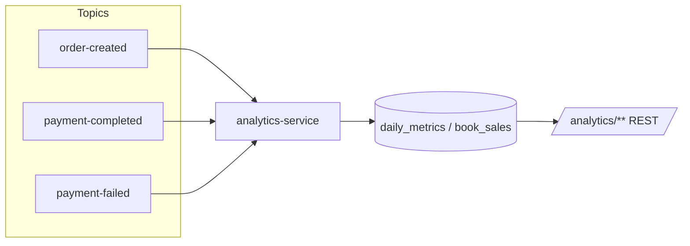

# Analytics API

Base path: `/analytics` &nbsp;•&nbsp; Service: `analytics-service` (port `8088`)

Every `/analytics/**` route requires `hasRole('ADMIN')`. Only actuator health/info are public. Date query params are optional `LocalDate` values in ISO format (`yyyy-MM-dd`).

:::warning Known gap
The service consumes `payment-completed` + `PaymentCompletedEvent`, but `payment-service` publishes `payment-success` + `PaymentSuccessEvent`. Until these are aligned, paid-order revenue may not populate. See [Kafka](../kafka/overview.md).
:::

---

## GET /analytics/dashboard

Headline metrics for the admin dashboard.

**Response `200 OK` — `DashboardResponse`**

| Field | Type |
| --- | --- |
| `totalOrders` | number (long) |
| `paidOrders` | number (long) |
| `failedPayments` | number (long) |
| `totalRevenue` | number (BigDecimal) |
| `averageOrderValue` | number (BigDecimal) |
| `booksSold` | number (long) |
| `paymentSuccessRate` | number (double) |

```json
{
  "totalOrders": 1280,
  "paidOrders": 1150,
  "failedPayments": 130,
  "totalRevenue": 84590.75,
  "averageOrderValue": 73.56,
  "booksSold": 3120,
  "paymentSuccessRate": 89.84
}
```

---

## GET /analytics/revenue

Total revenue plus daily and monthly breakdowns.

| Param | In | Type | Required |
| --- | --- | --- | --- |
| `from` | query | date | no |
| `to` | query | date | no |

**Response `200 OK` — `RevenueResponse`**

| Field | Type |
| --- | --- |
| `totalRevenue` | number (BigDecimal) |
| `daily` | array&lt;`DailyRevenueItem`&gt; |
| `monthly` | array&lt;`MonthlyRevenueItem`&gt; |

**`DailyRevenueItem`:** `date` (date), `revenue` (BigDecimal), `paidOrders` (long).
**`MonthlyRevenueItem`:** `month` (string), `revenue` (BigDecimal), `paidOrders` (long), `ordersCreated` (long).

```json
{
  "totalRevenue": 84590.75,
  "daily": [ { "date": "2026-08-04", "revenue": 1299.50, "paidOrders": 18 } ],
  "monthly": [ { "month": "2026-08", "revenue": 84590.75, "paidOrders": 1150, "ordersCreated": 1280 } ]
}
```

---

## GET /analytics/revenue/daily

| Param | In | Type | Required |
| --- | --- | --- | --- |
| `from` | query | date | no |
| `to` | query | date | no |

**Response `200 OK` — `List<DailyRevenueItem>`.**

---

## GET /analytics/revenue/monthly

| Param | In | Type | Required |
| --- | --- | --- | --- |
| `from` | query | date | no |
| `to` | query | date | no |

**Response `200 OK` — `List<MonthlyRevenueItem>`.**

---

## GET /analytics/orders

| Param | In | Type | Required |
| --- | --- | --- | --- |
| `from` | query | date | no |
| `to` | query | date | no |

**Response `200 OK` — `OrdersAnalyticsResponse`**

| Field | Type |
| --- | --- |
| `totalOrders` | number (long) |
| `paidOrders` | number (long) |
| `daily` | array&lt;`DailyOrderItem`&gt; |
| `monthly` | array&lt;`MonthlyRevenueItem`&gt; |

**`DailyOrderItem`:** `date` (date), `ordersCreated` (long), `paidOrders` (long).

---

## GET /analytics/books

**Response `200 OK` — `BooksAnalyticsResponse`**

| Field | Type |
| --- | --- |
| `booksSold` | number (long) |
| `topBooks` | array&lt;`TopBookItem`&gt; |

**`TopBookItem`:** `bookId` (UUID), `bookTitle` (string), `quantitySold` (long), `revenue` (BigDecimal).

```json
{
  "booksSold": 3120,
  "topBooks": [
    { "bookId": "abcabc01-2345-4678-89ab-cdef01234567", "bookTitle": "The Pragmatic Programmer", "quantitySold": 210, "revenue": 8397.90 }
  ]
}
```

---

## GET /analytics/payments

**Response `200 OK` — `PaymentsAnalyticsResponse`**

| Field | Type |
| --- | --- |
| `paidOrders` | number (long) |
| `failedPayments` | number (long) |
| `paymentSuccessRate` | number (double) |

```json
{ "paidOrders": 1150, "failedPayments": 130, "paymentSuccessRate": 89.84 }
```

---

## Ingestion pipeline


