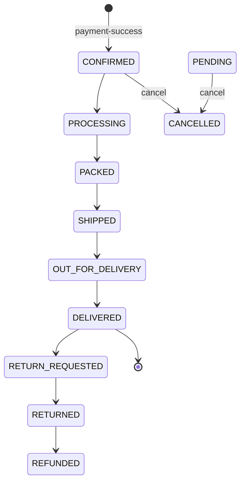

# Orders API

Base path: `/api/orders` &nbsp;•&nbsp; Service: `order-service` (port `8084`)

Every route requires `Authorization: Bearer <token>`. There is **no** create-order endpoint — confirmed orders are built asynchronously from the `payment-success` Kafka event. Ownership checks inside the service compare the order's `userId` against the JWT subject, with an admin override.

---

## GET /api/orders/me

List orders belonging to the authenticated user.

**Auth:** authenticated (uses principal `userId`)

**Response `200 OK` — `List<OrderResponse>`**

### `OrderResponse`

| Field | Type |
| --- | --- |
| `orderId` | UUID |
| `userId` | UUID |
| `totalAmount` | number (BigDecimal) |
| `status` | `OrderStatus` |
| `items` | array&lt;`OrderItemResponse`&gt; |
| `createdAt` | string (ISO-8601) |
| `updatedAt` | string (ISO-8601) |

### `OrderItemResponse`

| Field | Type |
| --- | --- |
| `bookId` | UUID |
| `bookTitle` | string |
| `quantity` | number (Integer) |
| `price` | number (BigDecimal) |

```json
[
  {
    "orderId": "0d1e2f30-4152-4637-8495-a6b7c8d9e0f1",
    "userId": "3f1c2d4e-5a6b-47c8-9d0e-1f2a3b4c5d6e",
    "totalAmount": 79.98,
    "status": "CONFIRMED",
    "items": [
      { "bookId": "abcabc01-2345-4678-89ab-cdef01234567", "bookTitle": "The Pragmatic Programmer", "quantity": 2, "price": 39.99 }
    ],
    "createdAt": "2026-08-04T18:00:00",
    "updatedAt": "2026-08-04T18:00:05"
  }
]
```

---

## GET /api/orders/&#123;id&#125;

Get a single order by ID. Allowed for the owner or an admin.

| Param | In | Type |
| --- | --- | --- |
| `id` | path | UUID |

**Response `200 OK` — `OrderResponse`.**

---

## GET /api/orders/payment/&#123;paymentId&#125;

Get the order associated with a payment. Owner or admin.

| Param | In | Type |
| --- | --- | --- |
| `paymentId` | path | UUID |

**Response `200 OK` — `OrderResponse`.**

---

## GET /api/orders/userId

Get orders for a specific user ID (self or admin).

| Param | In | Type | Required |
| --- | --- | --- | --- |
| `id` | query | UUID | yes |

```http
GET /api/orders/userId?id=3f1c2d4e-5a6b-47c8-9d0e-1f2a3b4c5d6e
Authorization: Bearer <token>
```

**Response `200 OK` — `List<OrderResponse>`.**

---

## GET /api/orders

List all orders in the system.

**Auth:** `hasRole('ADMIN')`

**Response `200 OK` — `List<OrderResponse>`.**

---

## PUT /api/orders/&#123;orderId&#125;/status

Update an order's status.

**Auth:** `hasRole('ADMIN')`

| Param | In | Type | Required |
| --- | --- | --- | --- |
| `orderId` | path | UUID | yes |
| `status` | query | `OrderStatus` | yes |

```http
PUT /api/orders/0d1e2f30-4152-4637-8495-a6b7c8d9e0f1/status?status=SHIPPED
Authorization: Bearer <admin token>
```

**Response `200 OK` — `OrderResponse`** with the new status.

---

## POST /api/orders/&#123;orderId&#125;/cancel

Cancel an order. Allowed for the owner (or admin). Only permitted while the order is in a cancelable status.

| Param | In | Type |
| --- | --- | --- |
| `orderId` | path | UUID |

**Cancelable statuses:** `CREATED`, `PENDING`, `PAYMENT_PENDING`, `CONFIRMED`.

**Response:** `204 No Content`.

---

## `OrderStatus` values

```text
PENDING · CREATED · PAYMENT_PENDING · PAYMENT_FAILED · PAID · CONFIRMED
PROCESSING · PACKED · SHIPPED · OUT_FOR_DELIVERY · DELIVERED
CANCEL_REQUESTED · CANCELLED · RETURN_REQUESTED · RETURNED · REFUNDED
```

## Status lifecycle (typical happy path)


