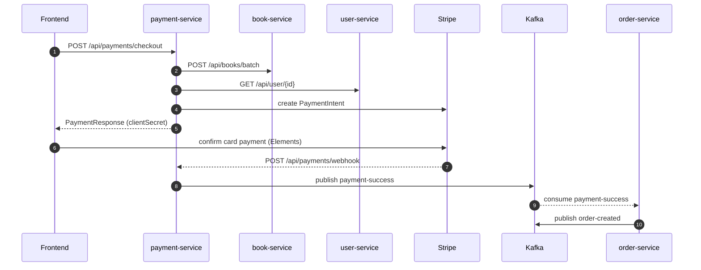

# Payments API

Base path: `/api/payments` &nbsp;•&nbsp; Service: `payment-service` (port `8087`)

`POST /api/payments/webhook` and `/actuator/health` are public. All other routes require `Authorization: Bearer <token>`. There are no `@PreAuthorize` annotations; ownership is enforced in the service — a payment must belong to the JWT subject (`userId`).

---

## POST /api/payments/checkout

Create (or reuse) a checkout and its Stripe PaymentIntent.

**Auth:** authenticated — the `Authorization` header is read explicitly and forwarded to `book-service` / `user-service`.

**Request body — `CreateCheckoutRequest`**

| Field | Type | Notes |
| --- | --- | --- |
| `checkoutId` | UUID | Idempotency key for the cart |
| `items` | array&lt;`CheckoutItemRequest`&gt; | Required, non-empty |

**`CheckoutItemRequest`**

| Field | Type | Validation |
| --- | --- | --- |
| `bookId` | UUID | required |
| `quantity` | number (Integer) | `1..2000` |

```http
POST /api/payments/checkout
Authorization: Bearer <token>
Content-Type: application/json
```

```json
{
  "checkoutId": "1f9de882-72b0-48c1-b966-e0345c2e25ea",
  "items": [
    { "bookId": "abcabc01-2345-4678-89ab-cdef01234567", "quantity": 2 }
  ]
}
```

**Response `200 OK` — `PaymentResponse`**

| Field | Type |
| --- | --- |
| `paymentId` | UUID |
| `checkoutId` | UUID |
| `orderId` | UUID (nullable until order is created) |
| `amount` | number (BigDecimal) |
| `status` | `PaymentStatus` |
| `paymentIntentId` | string |
| `clientSecret` | string |
| `items` | array&lt;`PaymentItemResponse`&gt; |

**`PaymentItemResponse`:** `bookId` (UUID), `bookTitle` (string), `quantity` (Integer), `price` (BigDecimal).

```json
{
  "paymentId": "5a6b7c8d-9e0f-4112-8233-4455667788aa",
  "checkoutId": "1f9de882-72b0-48c1-b966-e0345c2e25ea",
  "orderId": null,
  "amount": 79.98,
  "status": "PAYMENT_PENDING",
  "paymentIntentId": "pi_3Nabc123XYZ",
  "clientSecret": "pi_3Nabc123XYZ_secret_9zXyW",
  "items": [
    { "bookId": "abcabc01-2345-4678-89ab-cdef01234567", "bookTitle": "The Pragmatic Programmer", "quantity": 2, "price": 39.99 }
  ]
}
```

The frontend passes `clientSecret` to Stripe Elements to confirm the payment client-side.

---

## GET /api/payments/&#123;paymentId&#125;

Fetch a payment owned by the current user.

| Param | In | Type |
| --- | --- | --- |
| `paymentId` | path | UUID |

**Response `200 OK` — `PaymentResponse`.** A payment not owned by the caller is treated as not found.

---

## POST /api/payments/&#123;paymentId&#125;/sync-order

Recovery hook: re-publishes the `payment-success` event for an already-successful payment (e.g. if the order was not created the first time).

| Param | In | Type |
| --- | --- | --- |
| `paymentId` | path | UUID |

**Response `200 OK` — raw string** `"payment-success re-published for paymentId={id}"`.

---

## POST /api/payments/webhook

Stripe webhook receiver. Public, but the payload signature is verified.

**Auth:** none. Required header: `Stripe-Signature`. Body is the **raw Stripe event payload** (string), not a bookstore DTO.

```http
POST /api/payments/webhook
Stripe-Signature: t=1699999999,v1=abc123...
Content-Type: application/json

{ "id": "evt_...", "type": "payment_intent.succeeded", "data": { ... } }
```

**Response `200 OK` — raw string** `"Webhook received"`.

On `payment_intent.succeeded` the service publishes `payment-success`; on failure it publishes `payment-failed`.

---

## `PaymentStatus` values

```text
PAYMENT_PENDING · SUCCESS · FAILED · REFUNDED
```

## End-to-end payment flow


