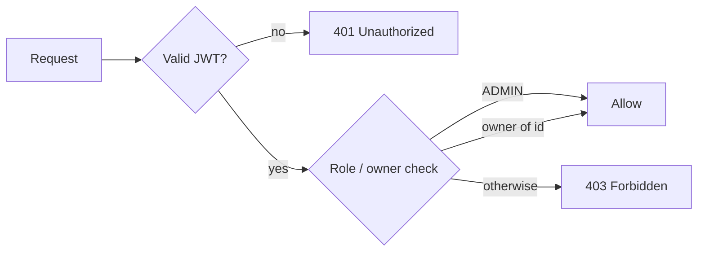

# Users API

Base path: `/api/user` &nbsp;•&nbsp; Service: `user-service` (port `8082`)

Every route requires `Authorization: Bearer <token>` except `POST /api/user/create`, which is internal-only and gated by the `X-Internal-Api-Key` header. Method-level security applies role and ownership rules; the JWT subject (`authentication.name`) is the caller's `userId`.

---

## GET /api/user/&#123;id&#125;

Fetch a single profile by user ID.

**Auth:** authenticated

| Param | In | Type |
| --- | --- | --- |
| `id` | path | UUID |

**Response `200 OK` — `UserResponseDto`**

| Field | Type |
| --- | --- |
| `userId` | string (UUID) |
| `firstName` | string |
| `lastName` | string |
| `email` | string |
| `phoneNumber` | string |
| `dateOfBirth` | string (`yyyy-MM-dd`) |
| `address` | string |
| `createdAt` | string (ISO-8601) |
| `updatedAt` | string (ISO-8601) |

```json
{
  "userId": "3f1c2d4e-5a6b-47c8-9d0e-1f2a3b4c5d6e",
  "firstName": "Ada",
  "lastName": "Lovelace",
  "email": "ada@example.com",
  "phoneNumber": "+15551234567",
  "dateOfBirth": "1990-12-10",
  "address": "12 Analytical Ave, London",
  "createdAt": "2026-08-01T10:15:30",
  "updatedAt": "2026-08-04T18:02:11"
}
```

---

## POST /api/user/create

Internal endpoint used by `auth-service` during registration. Not routed for external callers in normal flows.

**Auth:** `permitAll` + required header `X-Internal-Api-Key` (compared to `app.internal-api-key`)

**Request body — `CreateUserProfileRequest`**

| Field | Type |
| --- | --- |
| `userId` | UUID |
| `email` | string |
| `firstName` | string |
| `lastName` | string |
| `phoneNumber` | string |
| `dateOfBirth` | string (`yyyy-MM-dd`) |
| `address` | string |

```http
POST /api/user/create
X-Internal-Api-Key: <internal key>
Content-Type: application/json
```

```json
{
  "userId": "3f1c2d4e-5a6b-47c8-9d0e-1f2a3b4c5d6e",
  "email": "ada@example.com",
  "firstName": "Ada",
  "lastName": "Lovelace",
  "phoneNumber": "+15551234567",
  "dateOfBirth": "1990-12-10",
  "address": "12 Analytical Ave, London"
}
```

**Response `200 OK` — `UserResponseDto`.**

---

## GET /api/user/

List all user profiles.

**Auth:** `hasRole('ADMIN')`

**Response `200 OK` — `List<UserResponseDto>`**

```json
[
  { "userId": "3f1c2d4e-...", "firstName": "Ada", "lastName": "Lovelace", "email": "ada@example.com", "phoneNumber": "+15551234567", "dateOfBirth": "1990-12-10", "address": "12 Analytical Ave", "createdAt": "2026-08-01T10:15:30", "updatedAt": "2026-08-04T18:02:11" }
]
```

---

## PUT /api/user/update/&#123;id&#125;

Update a profile. Allowed for admins or the owner of the profile.

**Auth:** `hasRole('ADMIN') or #id.toString() == authentication.name`

| Param | In | Type |
| --- | --- | --- |
| `id` | path | UUID |

**Request body — `UserRequestDto`**

| Field | Type |
| --- | --- |
| `firstName` | string |
| `lastName` | string |
| `phoneNumber` | string |
| `dateOfBirth` | string (`yyyy-MM-dd`) |
| `email` | string |
| `address` | string |

```json
{
  "firstName": "Ada",
  "lastName": "King",
  "phoneNumber": "+15559990000",
  "dateOfBirth": "1990-12-10",
  "email": "ada@example.com",
  "address": "New Ockham Rd"
}
```

**Response `200 OK` — `UserResponseDto`.**

---

## DELETE /api/user/&#123;id&#125;

Delete a profile. Admins cannot delete their own account.

**Auth:** `hasRole('ADMIN') and #id.toString() != authentication.name`

| Param | In | Type |
| --- | --- | --- |
| `id` | path | UUID |

**Response `200 OK` — raw string**

```text
User with id : 3f1c2d4e-5a6b-47c8-9d0e-1f2a3b4c5d6e Deleted successfully
```

---

## GET /api/user/search

Search users by keyword.

**Auth:** `hasRole('ADMIN')`

| Param | In | Type | Required |
| --- | --- | --- | --- |
| `keyword` | query | string | yes |

```http
GET /api/user/search?keyword=ada
Authorization: Bearer <admin token>
```

**Response `200 OK` — `List<UserResponseDto>`.**

---

## Authorization matrix


