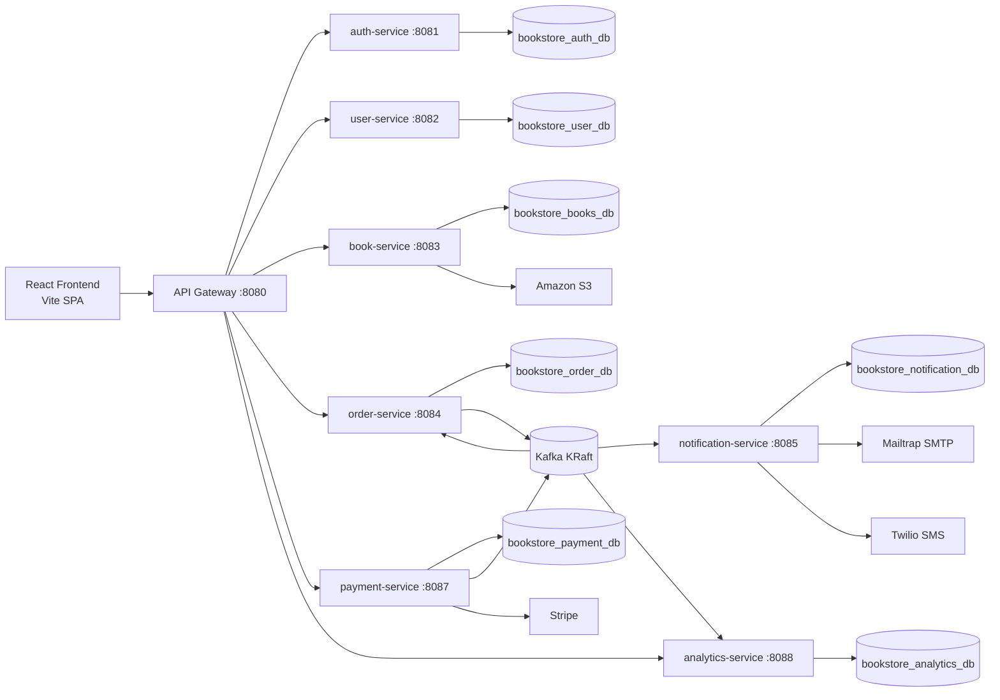
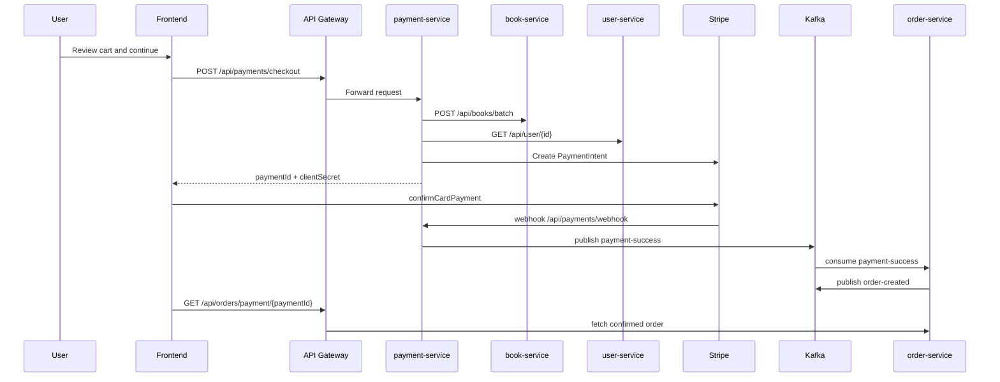
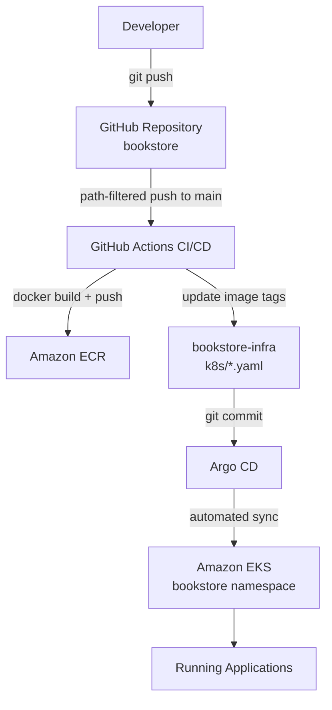

# Architecture Overview

## System diagram

## Backend architecture

All backend services are **Spring Boot 4.x** applications on **Java 17**, packaged as Docker images. Each service owns its database schema (database-per-service pattern) and validates JWTs independently.

### Service responsibilities

| Service | Primary role | Sync HTTP | Async (Kafka) |
| --- | --- | --- | --- |
| api-gateway | Route proxy, CORS | Receives all browser traffic | — |
| auth-service | Credentials, JWT issuance, refresh sessions | `/auth/**` | — |
| user-service | User profiles | `/api/user/**` | — |
| book-service | Catalog CRUD, cover upload | `/api/books/**`, etc. | — |
| order-service | Order read/cancel | `/api/orders/**` | Consumes `payment-success`; produces `order-created` |
| payment-service | Stripe checkout/webhooks | `/api/payments/**` | Produces `payment-success`, `payment-failed` |
| notification-service | Email + SMS | None (Kafka-only) | Consumes `order-created` |
| analytics-service | Admin dashboards | `/analytics/**` | Consumes `order-created`, `payment-failed`, `payment-completed` |

### REST communication (OpenFeign)

| Client | Caller | Target | Auth |
| --- | --- | --- | --- |
| `UserServiceClient` | auth-service | user-service `/api/user/create` | `X-Internal-Api-Key` header |
| `BookServiceClient` | order-service | book-service `/api/books/batch` | Forwards caller JWT |
| `UserServiceClient` | order-service | user-service profile endpoints | Forwards caller JWT |

`payment-service` uses **Spring `RestClient`** (not Feign) to call book-service and user-service during checkout.

### Event-driven communication (Kafka)

Kafka runs in **KRaft mode** (Apache Kafka 3.9.1) — locally via Docker Compose, in production as a Kubernetes StatefulSet in the `bookstore` namespace.

**Authentication flow**

1. User registers or logs in via `POST /auth/register` or `POST /auth/login`.
2. `auth-service` validates credentials, calls `user-service` to create a profile on registration, and returns a short-lived JWT access token plus a refresh token stored as a device session.
3. Frontend stores tokens and sends `Authorization: Bearer <token>` on subsequent requests.
4. Each secured service validates the JWT with a shared `JWT_SECRET`.
5. Token refresh: `POST /auth/refresh` rotates the refresh token.

**Payment flow (Stripe)**

**Notification flow**

1. `order-service` publishes `order-created` after building an order from `payment-success`.
2. `notification-service` consumes the event.
3. It sends email via Mailtrap SMTP and SMS via Twilio (when configured).
4. Notification delivery state is persisted in `bookstore_notification_db`.

**Analytics flow**

1. `analytics-service` consumes `order-created` and `payment-failed` events.
2. Events are deduplicated via a `processed_events` table.
3. Aggregates power admin dashboard APIs under `/analytics/**` (ADMIN role required).
4. See the [known topic mismatch](../intro/overview.md) for successful payment analytics.

## Database strategy

The project follows a **database-per-service** pattern:

| Service | Database |
| --- | --- |
| auth-service | `bookstore_auth_db` |
| user-service | `bookstore_user_db` |
| book-service | `bookstore_books_db` |
| order-service | `bookstore_order_db` |
| notification-service | `bookstore_notification_db` |
| payment-service | `bookstore_payment_db` |
| analytics-service | `bookstore_analytics_db` |

Locally, a single MySQL instance hosts all databases (initialized by `docker/mysql/init.sql`). In production, services connect to **Amazon RDS MySQL** inside the VPC.

## Security model

- JWT bearer tokens are issued by `auth-service`
- Refresh tokens are stored in `auth-service` as device sessions with rotation
- Most services require authentication for all routes, then narrow access with `@PreAuthorize`
- Admin-only paths are enforced in controllers and security config
- Internal service-to-service calls from auth-service to user-service use `X-Internal-Api-Key`

## Production deployment pipeline

Production deployment uses **GitOps**. Kubernetes manifests and Terraform live in the [**bookstore-infra**](https://github.com/ashishnamdeo16/bookstore-infra) repository (not in this codebase).

Details:

- [Deployment Overview](../deployment/overview.md)
- [CI/CD Pipeline](../deployment/ci-cd.md)
- [Kubernetes Deployment](../deployment/kubernetes.md)
- [AWS Architecture Overview](../aws/overview.md)

## What exists in each repository

| Asset | bookstore (this repo) | bookstore-infra |
| --- | --- | --- |
| Application source code | Yes | — |
| Docker Compose (local) | Yes | — |
| Per-service Dockerfiles | Yes | — |
| GitHub Actions CI workflow | Yes | — |
| Kubernetes manifests | — | Yes (`k8s/`) |
| Argo CD Applications | — | Yes |
| Terraform (VPC, EKS, RDS, ECR, S3, OIDC) | — | Yes |
| Monitoring stack (Prometheus, Grafana) | Actuator metrics only | Yes (`k8s/monitoring/`) |
