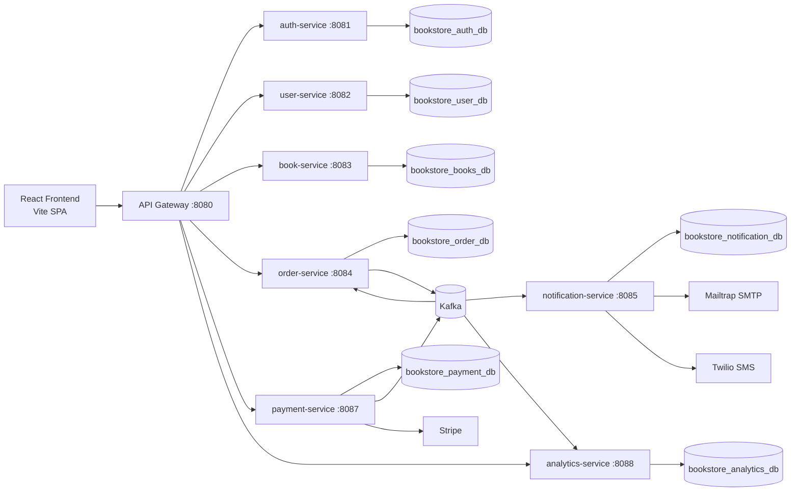
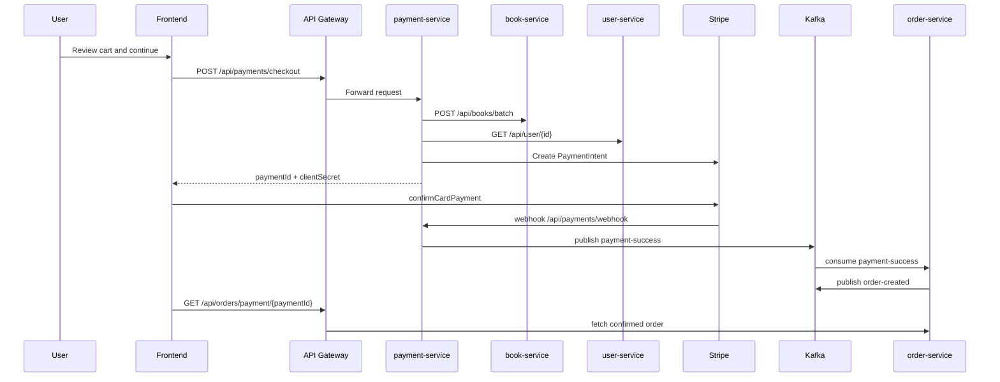

# Architecture Overview

## System diagram

## Request model

### Synchronous HTTP

- Frontend calls the gateway at `VITE_API_BASE_URL` or `http://localhost:8080`
- Gateway routes `/auth/**`, `/api/user/**`, `/api/books/**`, `/api/orders/**`, `/api/payments/**`, and `/analytics/**`
- Services validate JWTs independently

### Asynchronous event flow

- `order-service` publishes `order-created`
- `payment-service` publishes `payment-success` and `payment-failed`
- `notification-service` consumes `order-created`
- `order-service` consumes `payment-success`
- `analytics-service` consumes `order-created`, `payment-failed`, and currently expects `payment-completed`

## Database strategy

The project follows a database-per-service pattern:

| Service | Database |
| --- | --- |
| auth-service | `bookstore_auth_db` |
| user-service | `bookstore_user_db` |
| book-service | `bookstore_books_db` |
| order-service | `bookstore_order_db` |
| notification-service | `bookstore_notification_db` |
| payment-service | `bookstore_payment_db` |
| analytics-service | `bookstore_analytics_db` |

## Security model

- JWT bearer tokens are issued by `auth-service`
- Refresh tokens are stored in `auth-service` as device sessions
- Most services require authentication for all routes, then narrow access with `@PreAuthorize`
- Admin-only paths are enforced in controllers and security config

## Checkout flow

## Deployment architecture in the repository

The repository contains:

- Local Docker Compose
- A generic multi-service JVM Dockerfile at `docker/Dockerfile.service`

The repository does **not** currently contain:

- GitHub Actions workflows
- Nginx configuration
- Terraform / CloudFormation
- Kubernetes manifests

These should be treated as future work, not current implementation.
