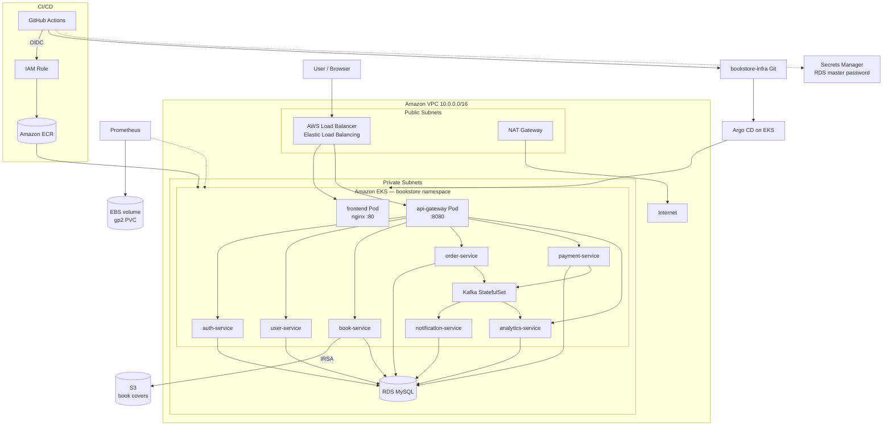
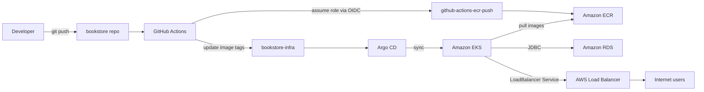
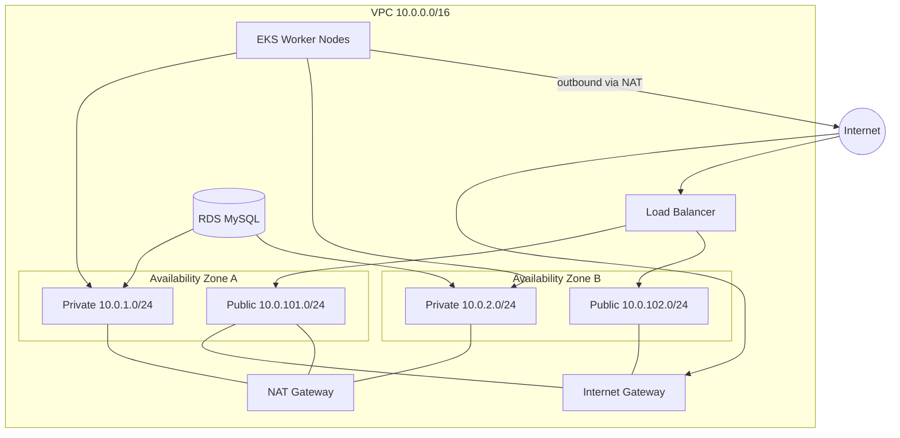
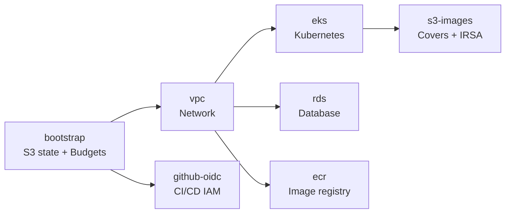

# AWS Cloud Architecture

This section documents **every AWS service and resource** used to run the Bookstore platform in production. All infrastructure is defined as Terraform in the [**bookstore-infra**](https://github.com/ashishnamdeo16/bookstore-infra) repository. Application code and CI live in [**bookstore**](https://github.com/ashishnamdeo16/bookstore).

| Setting | Value |
| --- | --- |
| AWS account | `XXXXXXXXXXXX` |
| Primary region | `us-west-2` |
| Project slug | `bookstore` |
| EKS cluster | `bookstore-eks` |
| ECR registry | `XXXXXXXXXXXX.dkr.ecr.us-west-2.amazonaws.com` |
| RDS endpoint | Private MySQL inside VPC |
| S3 (book covers) | `bookstore-book-images-XXXXXXXXXXXX` |
| Terraform state | `bookstore-tfstate-XXXXXXXXXXXX` |

---

## End-to-end architecture



---

## How the pieces connect



---

## AWS services reference

Every service below is **actually provisioned or used** in this project.

### Amazon VPC

**Purpose:** Private network for all AWS resources.

**Terraform module:** `bookstore-infra/vpc/`

| Setting | Value |
| --- | --- |
| CIDR | `10.0.0.0/16` (~65,000 addresses) |
| Availability zones | 2 |
| Private subnets | `10.0.1.0/24`, `10.0.2.0/24` — EKS nodes, RDS |
| Public subnets | `10.0.101.0/24`, `10.0.102.0/24` — load balancers, NAT |
| NAT gateway | Single shared NAT (cost-optimized) |
| DNS | Hostnames and support enabled |
| ELB tags | Public subnets tagged `kubernetes.io/role/elb=1`; private tagged `kubernetes.io/role/internal-elb=1` |

**Used by:** EKS worker nodes, RDS, internet-facing load balancers, NAT for outbound pod traffic.

---

### Amazon EC2

**Purpose:** Compute for Kubernetes worker nodes (not used for standalone VMs).

**How it appears:** EKS managed node group launches EC2 instances.

| Setting | Value |
| --- | --- |
| Instance type | `m7i-flex.large` (2 vCPU, 8 GiB RAM) |
| Node count | 1 desired, 1 min, 3 max (auto-scaling group) |
| Subnet placement | Private subnets only |
| AMI | EKS-optimized (managed by AWS) |

Worker nodes run all application pods, Kafka, Argo CD workloads, and the monitoring stack.

---

### Amazon EKS

**Purpose:** Managed Kubernetes control plane and orchestration for all microservices.

**Terraform module:** `bookstore-infra/eks/`

| Setting | Value |
| --- | --- |
| Cluster name | `bookstore-eks` |
| Kubernetes version | `1.33` |
| API endpoint | Public (for kubectl access) |
| Node group | `general` — managed, in private subnets |
| Addons | CoreDNS, kube-proxy, VPC CNI |
| Namespaces | `bookstore` (apps), `monitoring` (observability), `argocd` (GitOps) |

**Workloads running on EKS:**

- 8 microservices + api-gateway + frontend (Deployments)
- Kafka (StatefulSet)
- Prometheus, Grafana, Alertmanager (Deployments)
- Argo CD (installed separately; Applications defined in infra repo)

Configure kubectl after cluster creation:

```bash
aws eks update-kubeconfig --region us-west-2 --name bookstore-eks
```

---

### Amazon ECR

**Purpose:** Private Docker image registry. GitHub Actions pushes here; EKS pulls at deploy time.

**Terraform module:** `bookstore-infra/ecr/`

| Setting | Value |
| --- | --- |
| Registry URL | `XXXXXXXXXXXX.dkr.ecr.us-west-2.amazonaws.com` |
| Tag mutability | IMMUTABLE |
| Scan on push | Enabled |
| Lifecycle | Keep last 10 images per repository |

**Repositories (Terraform):**

`api-gateway`, `auth-service`, `user-service`, `book-service`, `order-service`, `payment-service`, `notification-service`, `analytics-service`

CI also pushes a `frontend` repository (created outside Terraform defaults).

**Image tag format:** 7-character git commit SHA (e.g. `6fa643b`).

---

### Amazon RDS (MySQL)

**Purpose:** Managed relational database hosting all microservice schemas.

**Terraform module:** `bookstore-infra/rds/`

| Setting | Value |
| --- | --- |
| Engine | MySQL `8.4` |
| Instance class | `db.t3.micro` |
| Storage | 20 GiB gp3, encrypted |
| Identifier | `bookstore-postgres` |
| Initial database | `bookstore` |
| Master username | `bookstore_admin` |
| Network | Private subnets only; `publicly_accessible = false` |
| Multi-AZ | No (single-AZ, cost-optimized) |
| Access | Security group allows port 3306 from VPC CIDR only |

**Databases used by services** (created by Hibernate `ddl-auto: update` or manual setup):

`bookstore_auth_db`, `bookstore_user_db`, `bookstore_books_db`, `bookstore_order_db`, `bookstore_payment_db`, `bookstore_notification_db`, `bookstore_analytics_db`

Pods read credentials from Kubernetes secret `db-credentials` (`DB_USERNAME`, `DB_PASSWORD`).

---

### Amazon S3

Two S3 buckets serve different purposes:

#### 1. Book cover images (`s3-images/` module)

| Setting | Value |
| --- | --- |
| Bucket | `bookstore-book-images-XXXXXXXXXXXX` |
| Access | Public **read** on objects (for `` URLs) |
| Write access | book-service only (via IRSA) |
| CORS | GET/HEAD from any origin |
| Versioning | Disabled |

Used by `book-service` `BookCoverStorageService` for cover uploads.

#### 2. Terraform remote state (`bootstrap/` module)

| Setting | Value |
| --- | --- |
| Bucket | `bookstore-tfstate-XXXXXXXXXXXX` |
| Access | Private (all public access blocked) |
| Encryption | AES-256 (SSE-S3) |
| Versioning | Enabled |
| Locking | S3 native (`use_lockfile = true`, Terraform 1.11+) |

State keys: `vpc/`, `eks/`, `rds/`, `ecr/`, `s3-images/`, `github-oidc/`

---

### AWS IAM

**Purpose:** Identity and access control for CI/CD pipelines and Kubernetes pods.

**Terraform modules:** `github-oidc/`, `s3-images/` (IRSA role)

#### Roles

| Role | Trust | Permissions |
| --- | --- | --- |
| `github-actions-ecr-push` | GitHub OIDC (`repo:ashishnamdeo16/bookstore:*`) | ECR push/pull (`ecr:GetAuthorizationToken`, layer upload, `PutImage`) |
| `book-service-s3-access` | EKS IRSA (`system:serviceaccount:bookstore:book-service`) | S3 Put/Get/Delete on book images bucket |

#### OIDC provider

- URL: `https://token.actions.githubusercontent.com`
- Audience: `sts.amazonaws.com`
- Defined in Terraform (`github-oidc/`) and referenced in this repo as `trust-policy.json`

GitHub Actions assumes `github-actions-ecr-push` via OIDC — **no long-lived AWS access keys** in GitHub secrets.

#### IRSA (IAM Roles for Service Accounts)

book-service pod uses a ServiceAccount annotated with:

```
eks.amazonaws.com/role-arn: arn:aws:iam::XXXXXXXXXXXX:role/book-service-s3-access
```

This lets the pod call S3 without embedding credentials in the container.

---

### AWS Secrets Manager

**Purpose:** Stores the RDS master password automatically.

**How it works:** Terraform sets `manage_master_user_password = true` on the RDS instance. AWS generates and rotates the master password in Secrets Manager. The Kubernetes `db-credentials` secret is populated separately for pod use.

---

### Elastic Load Balancing (ALB/NLB)

**Purpose:** Exposes the application to the internet.

**How it works (no standalone Terraform):**

- Kubernetes `Service` type `LoadBalancer` on `frontend` and `api-gateway` in the `bookstore` namespace
- EKS cloud controller provisions an AWS load balancer in public subnets (tagged via VPC module)
- Frontend LB serves the React SPA (nginx port 80)
- API gateway LB serves backend API routes (port 80 → 8080)

Example hostname pattern: `*.us-west-2.elb.amazonaws.com` (used as default `VITE_API_BASE_URL` in CI).

---

### Amazon EBS

**Purpose:** Block storage for persistent Kubernetes volumes.

| Usage | Storage class | Size |
| --- | --- | --- |
| Prometheus metrics data (`prometheus-data` PVC) | `gp2` | 10 GiB |
| RDS storage | gp3 (managed by RDS, not a K8s PVC) | 20 GiB |

EBS volumes are created automatically when Kubernetes binds a PVC to a pod in the `monitoring` namespace.

---

### AWS Budgets

**Purpose:** Cost guardrails and billing alerts.

**Terraform module:** `bookstore-infra/bootstrap/`

| Setting | Value |
| --- | --- |
| Budget name | `bookstore-monthly` |
| Limit | $50 USD/month (default) |
| Alert at 80% | Actual spend email notification |
| Alert at 100% | Forecasted spend email notification |

Configured during the bootstrap phase before any other infrastructure is provisioned.

---

### NAT Gateway

**Purpose:** Allows pods in private subnets to reach the internet (ECR image pulls, Stripe, Twilio, Mailtrap, external APIs).

**Provisioned by:** VPC Terraform module (`enable_nat_gateway = true`, `single_nat_gateway = true`)

**Cost note:** Single NAT gateway is used instead of one-per-AZ to reduce cost. Production HA deployments would use multiple NAT gateways.

---

## Network topology



### Traffic flows

| Direction | Path |
| --- | --- |
| **Inbound (users)** | Internet → IGW → ALB (public subnet) → EKS Service → Pod (private subnet) |
| **Outbound (pods)** | Pod → NAT gateway (public subnet) → IGW → Internet |
| **Database** | Pod (private) → RDS (private), port 3306, VPC CIDR only |
| **ECR pull** | kubelet on worker node → NAT → ECR API + registry |
| **S3 upload** | book-service pod → S3 API (via VPC endpoint or internet via NAT) |

---

## Terraform provisioning order

Infrastructure is built in phases. Each phase stores state in S3 and later phases read earlier outputs via `terraform_remote_state`.



| Phase | Module | AWS resources created |
| --- | --- | --- |
| 0 | `bootstrap/` | S3 state bucket, versioning, encryption, AWS Budget |
| 1 | `vpc/` | VPC, subnets, IGW, NAT, route tables, ELB tags |
| 2 | `eks/` | EKS cluster, managed node group, addons |
| 3 | `rds/` | RDS MySQL, subnet group, security group |
| 4 | `ecr/` | ECR repositories, lifecycle policies |
| 5 | `s3-images/` | S3 book images bucket, IRSA role for book-service |
| 6 | `github-oidc/` | OIDC provider, GitHub Actions IAM role |

All modules use **Terraform ≥ 1.11** with S3 native state locking.

---

## CI/CD and AWS integration

Detailed workflow documentation: [CI/CD Pipeline](../deployment/ci-cd.md)

| Step | AWS involvement |
| --- | --- |
| 1. Developer pushes code | None |
| 2. GitHub Actions starts | Assumes `github-actions-ecr-push` via OIDC |
| 3. Docker build + push | Image stored in Amazon ECR |
| 4. Manifest update | Commits to `bookstore-infra` (no AWS API) |
| 5. Argo CD sync | EKS pulls new image from ECR |
| 6. Rolling update | EC2 worker nodes run new pods |

**Repository secrets/vars used with AWS:**

| Name | Purpose |
| --- | --- |
| `INFRA_REPO_TOKEN` | Push manifest updates (GitHub, not AWS) |
| `ROLE_ARN` (in workflow env) | `arn:aws:iam::XXXXXXXXXXXX:role/github-actions-ecr-push` |
| `ECR_REGISTRY` (in workflow env) | ECR registry URL |

---

## Kubernetes on AWS

Detailed K8s documentation: [Kubernetes Deployment](../deployment/kubernetes.md)

| K8s resource | AWS backing |
| --- | --- |
| `Service type: LoadBalancer` | AWS Elastic Load Balancer |
| `PersistentVolumeClaim` (Prometheus) | Amazon EBS (gp2) |
| `ServiceAccount` + IRSA annotation | AWS IAM role |
| EKS managed node group | Amazon EC2 instances |
| Pod → RDS connection | Amazon RDS in same VPC |

---

## Monitoring on AWS

The observability stack runs **inside EKS**, not as separate AWS managed services (no Amazon Managed Prometheus, no CloudWatch Container Insights configured).

| Component | Storage | Namespace |
| --- | --- | --- |
| Prometheus | EBS PVC (10 Gi gp2) | `monitoring` |
| Grafana | Ephemeral pod storage | `monitoring` |
| Alertmanager | Ephemeral pod storage | `monitoring` |

Prometheus scrapes Spring Boot `/actuator/prometheus` endpoints from services annotated in the `bookstore` namespace.

See [Monitoring](../monitoring/logging.md) for scrape annotations and metric details.

---

## Security summary

| Layer | Mechanism |
| --- | --- |
| Network | Private subnets for compute and database; RDS not publicly accessible |
| CI/CD auth | GitHub OIDC → IAM role (no static AWS keys) |
| Pod → S3 | IRSA (short-lived credentials, scoped to one bucket) |
| Database | Security group restricts MySQL to VPC CIDR; credentials in K8s secret |
| Terraform state | S3 encrypted, versioned, public access blocked |
| ECR | Private registry; images pulled by EKS nodes only |
| S3 book images | Public read on objects only; write requires IAM role |

---

## Cost-related resources

| Resource | Cost consideration |
| --- | --- |
| EKS control plane | ~$0.10/hour per cluster |
| EC2 worker nodes | `m7i-flex.large` × desired count |
| NAT gateway | Hourly charge + data processing (single NAT to save cost) |
| RDS | `db.t3.micro` single-AZ |
| EBS | 10 Gi Prometheus PVC + 20 Gi RDS gp3 |
| ALB | Per load balancer (frontend + api-gateway = 2 LBs) |
| AWS Budget | Alerts at $50/month default threshold |

---

## What is not used

These AWS services are **not** part of the current architecture:

- AWS Lambda
- Amazon CloudFront
- Amazon API Gateway (AWS) — routing uses Spring Cloud Gateway on EKS
- Amazon MSK — Kafka runs as a pod on EKS
- Amazon ElastiCache
- AWS Fargate — EKS uses EC2 managed node groups
- Amazon Cognito — auth is custom JWT in auth-service
- AWS CloudFormation — infrastructure is Terraform

---

## Related documentation

- [Deployment Overview](../deployment/overview.md)
- [CI/CD Pipeline](../deployment/ci-cd.md)
- [Kubernetes Deployment](../deployment/kubernetes.md)
- [Architecture Overview](../architecture/overall.md)
- [Monitoring](../monitoring/logging.md)

**External repository:** [bookstore-infra on GitHub](https://github.com/ashishnamdeo16/bookstore-infra)
