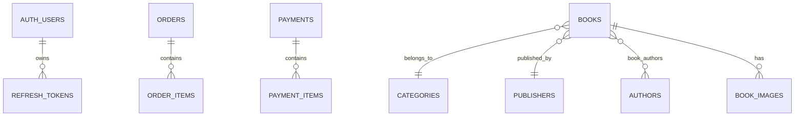

# Database

## Database-per-service model

The current repository uses a separate MySQL schema per service.

## Schemas created by `docker/mysql/init.sql`

- `bookstore_auth_db`
- `bookstore_user_db`
- `bookstore_books_db`
- `bookstore_order_db`
- `bookstore_notification_db`
- `bookstore_payment_db`

## Additional schema referenced in code

- `bookstore_analytics_db`

This analytics schema is referenced by `analytics-service`, but not created in `docker/mysql/init.sql`.

## Important tables

| Service | Tables |
| --- | --- |
| auth-service | `auth_users`, `refresh_tokens` |
| user-service | `users` |
| book-service | `books`, `authors`, `categories`, `publishers`, `book_images`, `book_authors` |
| order-service | `orders`, `order_items` |
| payment-service | `payments`, `payment_items` |
| notification-service | `notifications` |
| analytics-service | `daily_metrics`, `book_sales`, `pending_order_items`, `processed_events` |

## Transaction strategy

- `order-service` persists orders and publishes events **after commit**
- `payment-service` persists payment state around Stripe interaction and then publishes outcome events
- `analytics-service` uses deduplication rather than distributed transactions
