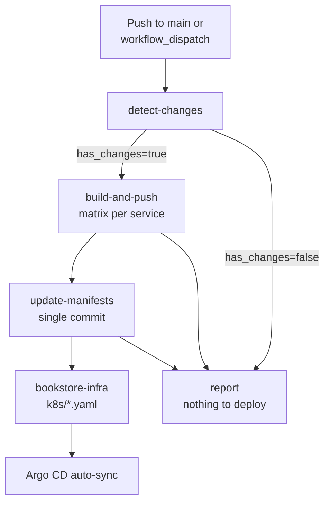

# CI/CD Pipeline

Continuous integration and deployment is handled by a single GitHub Actions workflow in this repository. Production Kubernetes manifests are updated in the separate [**bookstore-infra**](https://github.com/ashishnamdeo16/bookstore-infra) repository, and Argo CD syncs the cluster automatically.

**Workflow file:** `.github/workflows/ci-workflow.yml`  
**Helper script:** `.github/scripts/update_image_tag.py`

## Pipeline overview



## Triggers

### Push to `main` (path-filtered)

The workflow runs when files change under:

- `book-service/**`
- `payment-service/**`
- `order-service/**`
- `auth-service/**`
- `analytics-service/**`
- `notification-service/**`
- `user-service/**`
- `frontend/**`
- `.github/workflows/ci-workflow.yml`
- `.github/scripts/update_image_tag.py`

Only services whose directories actually changed are built. Pushing workflow-only changes triggers the workflow but skips build and deploy.

### Manual dispatch

Run from **Actions → CI - build and deploy services → Run workflow**:

| Input | Default | Description |
| --- | --- | --- |
| `services` | `all` | Comma-separated service names, or `all` for every service in the catalog |

Example manual values:

```
all
```

```
book-service, frontend, payment-service
```

## Jobs

### 1. detect-changes

- Checks out the full git history (`fetch-depth: 0`)
- On push: diffs against the previous commit to find changed service directories
- On manual run: uses the `services` input
- Outputs:
  - `services` — JSON array of service names
  - `has_changes` — `true` or `false`
  - `image_tag` — first 7 characters of the commit SHA (e.g. `6fa643b`)

### 2. build-and-push

Runs only when `has_changes == true`.

| Setting | Value |
| --- | --- |
| Platform | `linux/amd64` |
| Registry | `XXXXXXXXXXXX.dkr.ecr.us-west-2.amazonaws.com` |
| Region | `us-west-2` |
| Auth | OIDC → IAM role `github-actions-ecr-push` |
| Parallelism | Max 4 services at a time |
| Image tag | `{ECR_REGISTRY}/{service}:{image_tag}` |

**Build steps per service:**

1. Resolve Dockerfile (`Dockerfile`, `DockerFile`, or `dockerfile`)
2. Configure AWS credentials via OIDC
3. Log in to ECR
4. Build and push with Docker Buildx (GitHub Actions cache per service)
5. Upload artifact with the pushed tag for the manifest job

**Frontend build args** (compiled into the Vite bundle at build time):

- `VITE_API_BASE_URL` — from repository variable or default ELB URL
- `VITE_STRIPE_PUBLISHABLE_KEY` — from repository variable or default test key

### 3. update-manifests

Runs after all build jobs succeed. This is a **single job** that updates every manifest in **one commit** to avoid concurrent push races.

Steps:

1. Verify `INFRA_REPO_TOKEN` secret is set
2. Download pushed-tag artifacts from all matrix jobs
3. Clone `ashishnamdeo16/bookstore-infra` (branch `main`)
4. For each pushed service, run `update_image_tag.py`:
   - Rewrites only `image:` lines matching the service repository name
   - Validates YAML structure (when PyYAML is available)
   - Refuses to commit if non-image lines would change
5. Commit and push to `main` (retries up to 5 times on push rejection)

**Manifest path pattern:** `k8s/{service}.yaml`

### 4. report

Always runs. Fails the workflow if detect, build, or manifest update did not succeed. On success prints:

> Images pushed and bookstore-infra updated; Argo CD will sync.

## Secrets and configuration

| Name | Type | Purpose |
| --- | --- | --- |
| `INFRA_REPO_TOKEN` | Repository secret | Git push access to `bookstore-infra` |
| `VITE_API_BASE_URL` | Repository variable (optional) | Frontend API URL at build time |
| `VITE_STRIPE_PUBLISHABLE_KEY` | Repository variable (optional) | Stripe publishable key at build time |

**Environment variables** (in workflow `env:`):

| Variable | Value |
| --- | --- |
| `AWS_REGION` | `us-west-2` |
| `ECR_REGISTRY` | `XXXXXXXXXXXX.dkr.ecr.us-west-2.amazonaws.com` |
| `ROLE_ARN` | `arn:aws:iam::XXXXXXXXXXXX:role/github-actions-ecr-push` |
| `INFRA_REPO` | `ashishnamdeo16/bookstore-infra` |
| `INFRA_BRANCH` | `main` |
| `MANIFEST_DIR` | `k8s` |

## AWS authentication (OIDC)

GitHub Actions assumes the `github-actions-ecr-push` IAM role using **OIDC federation** — no long-lived AWS access keys in secrets.

The trust policy (also in `trust-policy.json` in this repo) restricts assumption to:

```
repo:ashishnamdeo16/bookstore:*
```

The IAM role policy (defined in `bookstore-infra/github-oidc/`) grants ECR push permissions only.

## Services in the CI catalog

| Service | In CI | In ECR (Terraform) | Notes |
| --- | --- | --- | --- |
| auth-service | Yes | Yes | |
| user-service | Yes | Yes | |
| book-service | Yes | Yes | |
| order-service | Yes | Yes | |
| payment-service | Yes | Yes | |
| notification-service | Yes | Yes | |
| analytics-service | Yes | Yes | |
| frontend | Yes | — | ECR repo not in Terraform defaults; images pushed to `frontend` repository |
| api-gateway | **No** | Yes | Image tag managed manually in infra repo |

## Argo CD synchronization

CI does **not** call the Argo CD API directly. After the manifest commit lands in `bookstore-infra`, the Argo CD Application (`k8s/argocd-app.yaml`) detects the Git change and syncs automatically because:

```yaml
syncPolicy:
  automated:
    prune: true
    selfHeal: true
```

## Testing the full pipeline

To build and deploy all services without code changes:

```bash
gh workflow run ci-workflow.yml --ref main -f services=all
```

Or use the GitHub Actions UI with `services = all`.

## Related documentation

- [Deployment Overview](./overview.md)
- [Kubernetes Deployment](./kubernetes.md)
- [AWS Architecture Overview](../aws/overview.md)
