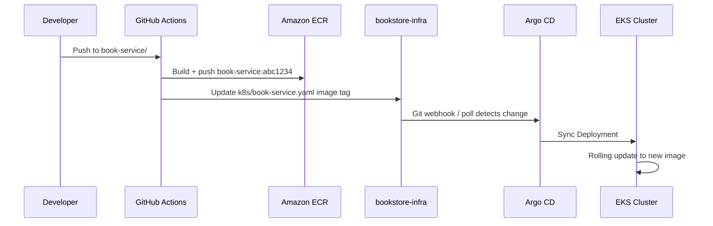

# Kubernetes Deployment

Production Kubernetes manifests are maintained in the [**bookstore-infra**](https://github.com/ashishnamdeo16/bookstore-infra) repository under `k8s/`. This page documents the resources that exist there — not in the application codebase.

## Namespaces

| Namespace | Workloads |
| --- | --- |
| `bookstore` | All microservices, frontend, api-gateway, Kafka |
| `monitoring` | Prometheus, Grafana, Alertmanager |
| `argocd` | Argo CD Applications (control plane) |

## Manifest inventory

| File | Resources | External access |
| --- | --- | --- |
| `auth-service.yaml` | Deployment, Service | Cluster-internal (:8081) |
| `user-service.yaml` | Deployment, Service | Cluster-internal (:8082) |
| `book-service.yaml` | ServiceAccount, Deployment, Service | Cluster-internal (:8083) |
| `order-service.yaml` | Deployment, Service | Cluster-internal (:8084) |
| `payment-service.yaml` | Deployment, Service | Cluster-internal (:8087) |
| `notification-service.yaml` | Deployment, Service | Cluster-internal (:8085) |
| `analytics-service.yaml` | Deployment, Service | Cluster-internal (:8088) |
| `api-gateway.yaml` | Deployment, Service (LoadBalancer) | External via AWS LB (:80 → :8080) |
| `frontend.yaml` | Deployment, Service (LoadBalancer) | External via AWS LB (:80) |
| `kafka.yaml` | StatefulSet, Service | Cluster-internal (:9092) |
| `argocd-app.yaml` | Argo CD Application | — |
| `monitoring-apps.yaml` | Namespace + 3 Argo CD Applications | — |

Monitoring component manifests live under `k8s/monitoring/` (prometheus, grafana, alertmanager subdirectories).

## Deployments

Each microservice Deployment follows a common pattern:

- **Replicas:** 1 (learning/single-AZ setup)
- **Image:** `XXXXXXXXXXXX.dkr.ecr.us-west-2.amazonaws.com/{service}:{tag}`
- **Profile:** `SPRING_PROFILES_ACTIVE=prod` (or `docker` for api-gateway)
- **Resources:** Typical requests 250m CPU / 512Mi memory; limits 500m / 1Gi
- **Database:** `DB_URL` pointing to Amazon RDS MySQL endpoint inside the VPC
- **Secrets:** `DB_USERNAME` and `DB_PASSWORD` from Kubernetes secret `db-credentials`

### book-service (IRSA for S3)

The book-service Deployment uses a dedicated ServiceAccount annotated for **IAM Roles for Service Accounts (IRSA)**:

```yaml
annotations:
  eks.amazonaws.com/role-arn: arn:aws:iam::XXXXXXXXXXXX:role/book-service-s3-access
```

Environment variables include `S3_BUCKET_NAME` and `AWS_REGION` for cover image uploads.

### api-gateway

Routes to cluster-internal service DNS names:

| Env var | Target |
| --- | --- |
| `AUTH_SERVICE_URI` | `http://auth-service:8081` |
| `USER_SERVICE_URI` | `http://user-service:8082` |
| `BOOK_SERVICE_URI` | `http://book-service:8083` |
| `ORDER_SERVICE_URI` | `http://order-service:8084` |
| `PAYMENT_SERVICE_URI` | `http://payment-service:8087` |
| `ANALYTICS_SERVICE_URI` | `http://analytics-service:8088` |

Exposed via `Service` type **LoadBalancer** (port 80 → container 8080).

### frontend

Production frontend image served by nginx on port 80. Exposed via `Service` type **LoadBalancer**.

The frontend Docker image proxies `/auth/`, `/api/`, and `/analytics/` to the API gateway (configured at container start via `API_UPSTREAM`).

## Services

Cluster-internal services use Kubernetes DNS (`{name}.bookstore.svc.cluster.local`).

Services with **Prometheus scrape annotations** (example from book-service):

```yaml
annotations:
  prometheus.io/scrape: "true"
  prometheus.io/path: /actuator/prometheus
  prometheus.io/port: "8083"
```

These annotations are consumed by the Prometheus deployment in the `monitoring` namespace.

## Kafka (StatefulSet)

Kafka runs as a single-broker **StatefulSet** using `apache/kafka:3.9.1` in KRaft mode:

- Advertised listener: `PLAINTEXT://kafka.bookstore.svc.cluster.local:9092`
- No Zookeeper
- Single replica (replication factor 1)

All microservices connect via `KAFKA_BOOTSTRAP_SERVERS=kafka.bookstore.svc.cluster.local:9092` in their production configuration.

## Secrets

| Secret | Keys | Used by |
| --- | --- | --- |
| `db-credentials` | `DB_USERNAME`, `DB_PASSWORD` | All services connecting to RDS |

RDS master credentials are managed by AWS Secrets Manager (via Terraform `manage_master_user_password = true`). The Kubernetes secret is populated separately for pod consumption.

Application secrets (Stripe keys, JWT secret, Mailtrap, Twilio) are set as environment variables in the deployment manifests or via additional secrets — check each service YAML for the current configuration.

## ConfigMaps

| ConfigMap | Namespace | Purpose |
| --- | --- | --- |
| `prometheus-config` | `monitoring` | Prometheus scrape config, alerting rules reference, Alertmanager target |

Prometheus discovers bookstore services via Kubernetes service discovery, keeping pods annotated with `prometheus.io/scrape: "true"`.

## Persistent Volumes

| PVC | Namespace | Storage class | Size | Used by |
| --- | --- | --- | --- | --- |
| `prometheus-data` | `monitoring` | `gp2` (EBS) | 10 Gi | Prometheus time-series data |

Application databases use **Amazon RDS** (managed, outside the cluster). Book cover images use **Amazon S3** (not PV-backed).

## Argo CD GitOps workflow

### Main application

`k8s/argocd-app.yaml` defines the `bookstore` Application:

```yaml
source:
  repoURL: https://github.com/ashishnamdeo16/bookstore-infra.git
  path: k8s
  targetRevision: main
destination:
  namespace: bookstore
syncPolicy:
  automated:
    prune: true
    selfHeal: true
```

When GitHub Actions commits an image tag update to `k8s/book-service.yaml` (for example), Argo CD detects the drift and rolls out the new Deployment automatically.

### Monitoring applications

`k8s/monitoring-apps.yaml` defines three separate Argo CD Applications:

- `monitoring-prometheus` → `k8s/monitoring/prometheus`
- `monitoring-grafana` → `k8s/monitoring/grafana`
- `monitoring-alertmanager` → `k8s/monitoring/alertmanager`

Each uses automated sync with `CreateNamespace=true` for the `monitoring` namespace.

## End-to-end sync flow



## Related documentation

- [Deployment Overview](./overview.md)
- [CI/CD Pipeline](./ci-cd.md)
- [AWS Architecture Overview](../aws/overview.md)
- [Monitoring](../monitoring/logging.md)
