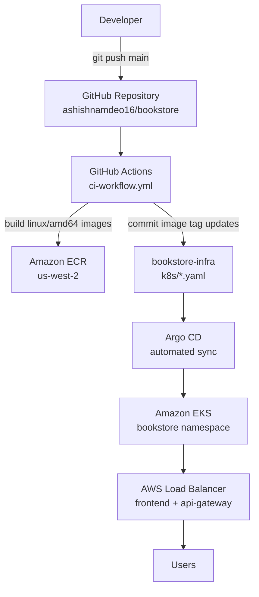

# Deployment Overview

The Bookstore platform supports two deployment modes:

| Mode | Configuration | Use case |
| --- | --- | --- |
| **Local** | `docker-compose.yml` in this repository | Development and demos on localhost |
| **Production** | [bookstore-infra](https://github.com/ashishnamdeo16/bookstore-infra) (Terraform + Kubernetes + Argo CD) | AWS EKS cluster with GitOps |

## Production deployment pipeline



When a developer pushes a change to a service directory on `main`, GitHub Actions builds a new Docker image, pushes it to ECR, updates the image tag in the infra repo, and Argo CD automatically syncs the cluster to match Git.

See [CI/CD Pipeline](./ci-cd.md) for workflow details and [Kubernetes Deployment](./kubernetes.md) for manifest structure.

## Local deployment (Docker Compose)

The root `docker-compose.yml` is the local deployment artifact. It defines:

| Component | Image / build | Port |
| --- | --- | --- |
| MySQL 8.4 | `mysql:8.4` | 3306 |
| Kafka 3.9.1 (KRaft) | `apache/kafka:3.9.1` | 9092 |
| auth-service | `./auth-service/Dockerfile` | 8081 |
| user-service | `./user-service/DockerFile` | 8082 |
| book-service | `./book-service/Dockerfile` | 8083 |
| order-service | `./order-service/Dockerfile` | 8084 |
| notification-service | `./notification-service/DockerFile` | 8085 |
| payment-service | `./payment-service/DockerFile` | 8087 |
| analytics-service | `./analytics-service/Dockerfile` | 8088 |
| api-gateway | `./api-gateway/Dockerfile` | 8080 |

**Not included in Compose:** `frontend` (run separately with `npm run dev` or build the production Docker image manually).

Start the full stack:

```bash
docker compose up --build -d
```

Start infrastructure only:

```bash
docker compose up mysql kafka -d
```

## Docker containerization

Each backend service uses a **two-stage Dockerfile**:

1. **Build stage** — Maven 3.9 + Eclipse Temurin 17 compiles the JAR
2. **Runtime stage** — Temurin 17 JRE, non-root `spring` user

The frontend production image (`frontend/Dockerfile`):

1. **Build stage** — Node 22 builds the Vite bundle with `VITE_*` build args
2. **Runtime stage** — nginx 1.27 serves static files and proxies `/auth/`, `/api/`, `/analytics/` to the API gateway

Nginx configuration: `frontend/nginx.conf` (same-origin API proxy to avoid CORS in production).

A generic template also exists at `docker/Dockerfile.service` for reference.

## Production Kubernetes (bookstore-infra)

Kubernetes manifests are maintained in the [**bookstore-infra**](https://github.com/ashishnamdeo16/bookstore-infra) repository under `k8s/`:

| Manifest | Kind | Notes |
| --- | --- | --- |
| `auth-service.yaml` | Deployment + Service | Connects to RDS MySQL |
| `user-service.yaml` | Deployment + Service | Prometheus scrape annotations |
| `book-service.yaml` | Deployment + Service + ServiceAccount | IRSA for S3 access |
| `order-service.yaml` | Deployment + Service | Kafka + Feign to book/user |
| `payment-service.yaml` | Deployment + Service | Stripe secrets |
| `notification-service.yaml` | Deployment + Service | Kafka consumer |
| `analytics-service.yaml` | Deployment + Service | Kafka consumer |
| `api-gateway.yaml` | Deployment + Service (LoadBalancer) | Routes to all backends |
| `frontend.yaml` | Deployment + Service (LoadBalancer) | nginx on port 80 |
| `kafka.yaml` | StatefulSet + Service | KRaft mode, single broker |
| `argocd-app.yaml` | Argo CD Application | Syncs `k8s/` → `bookstore` namespace |
| `monitoring-apps.yaml` | Argo CD Applications | Prometheus, Grafana, Alertmanager |

All application workloads run in the **`bookstore`** namespace. Monitoring runs in the **`monitoring`** namespace.

### Kubernetes resources used

| Resource | Purpose |
| --- | --- |
| **Deployments** | One per microservice + frontend + api-gateway |
| **StatefulSet** | Kafka broker |
| **Services** | Cluster-internal DNS; LoadBalancer type for frontend and api-gateway |
| **ServiceAccounts** | book-service (IRSA for S3), prometheus |
| **Secrets** | `db-credentials` (RDS username/password from Kubernetes secret) |
| **ConfigMaps** | Prometheus scrape configuration |
| **PersistentVolumeClaims** | Prometheus data (`gp2` storage class, 10 Gi) |

ConfigMaps and Secrets for application configuration are defined inline in the deployment manifests or referenced via `secretKeyRef` (e.g. `db-credentials`).

### Argo CD GitOps

The `bookstore` Argo CD Application (in `k8s/argocd-app.yaml`):

- **Source:** `https://github.com/ashishnamdeo16/bookstore-infra.git`, path `k8s/`, branch `main`
- **Destination:** in-cluster, namespace `bookstore`
- **Sync policy:** automated with `prune: true` and `selfHeal: true`

Argo CD applies every manifest under `k8s/` when the infra repo changes — including image tag updates committed by GitHub Actions.

Separate Argo CD Applications manage the monitoring stack (`monitoring-prometheus`, `monitoring-grafana`, `monitoring-alertmanager`).

## AWS infrastructure

Terraform modules in `bookstore-infra` provision:

- VPC with public/private subnets and NAT gateway
- Amazon EKS cluster with managed node groups
- Amazon RDS MySQL (private, VPC-only access)
- Amazon ECR repositories (one per service)
- Amazon S3 bucket for book cover images
- IAM roles for GitHub Actions OIDC and book-service IRSA

See [AWS Architecture Overview](../aws/overview.md) for the full breakdown.

## CI/CD services in scope

GitHub Actions builds and deploys these **8 services** on change:

`book-service`, `payment-service`, `order-service`, `auth-service`, `user-service`, `notification-service`, `analytics-service`, `frontend`

**Not in CI:** `api-gateway` (image is managed manually in the infra repo; ECR repository exists).

## Related documentation

- [CI/CD Pipeline](./ci-cd.md)
- [Kubernetes Deployment](./kubernetes.md)
- [AWS Architecture Overview](../aws/overview.md)
- [Monitoring](../monitoring/logging.md)
