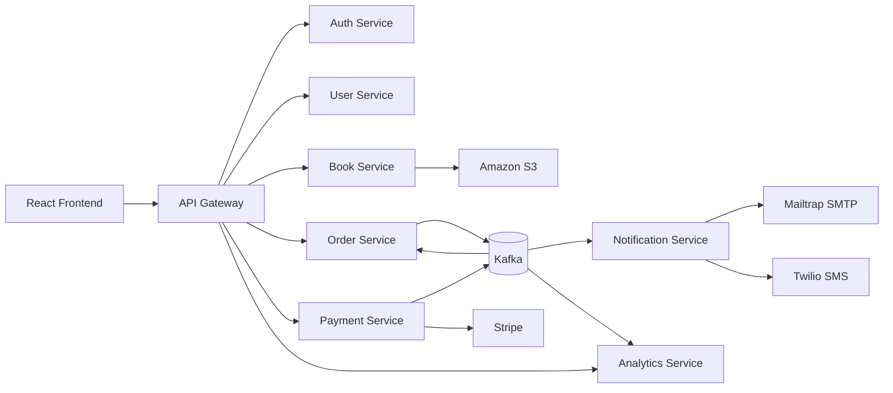

# Bookstore Microservices

This repository implements a bookstore platform as a set of Spring Boot microservices behind a Spring Cloud Gateway, plus a React + Vite frontend. The project supports local development with Docker Compose and production-style deployment on AWS EKS using GitOps (Argo CD).

## Architecture at a glance



## Services

| Service | Port (local) | Responsibility |
| --- | --- | --- |
| **API Gateway** | 8080 | Single HTTP entry point; routes `/auth/**`, `/api/**`, `/analytics/**` to backend services; CORS |
| **Auth Service** | 8081 | Registration, login, JWT access tokens, refresh-token sessions |
| **User Service** | 8082 | User profile CRUD; internal profile creation via API key |
| **Book Service** | 8083 | Catalog (books, authors, categories, publishers); S3 book cover upload |
| **Order Service** | 8084 | Order queries and cancellation; builds orders from Kafka `payment-success` events |
| **Payment Service** | 8087 | Stripe PaymentIntent checkout, webhooks, payment state |
| **Notification Service** | 8085 | Email and SMS on `order-created` (Kafka consumer only — no HTTP API) |
| **Analytics Service** | 8088 | Admin dashboards fed from Kafka events |
| **Frontend** | 5173 dev / 80 prod | React SPA: catalog, cart, checkout, admin analytics |

## Repository layout

```text
auth-service/
user-service/
book-service/
order-service/
payment-service/
notification-service/
analytics-service/
api-gateway/
frontend/
docker/
docker-compose.yml
.github/workflows/ci-workflow.yml
bookstore-docs/
```

Production Kubernetes manifests, Terraform, and Argo CD applications live in the separate [**bookstore-infra**](https://github.com/ashishnamdeo16/bookstore-infra) repository.

## Key platform capabilities

- User registration and login with JWT + refresh tokens
- JWT-protected customer and admin routes
- Catalog CRUD for books, authors, categories, and publishers
- Book cover upload to Amazon S3 (production)
- Cart and checkout flow in the frontend
- Stripe payment intent creation and webhook handling
- Order creation from payment success events via Kafka
- Notification fan-out (email + SMS) from order events
- Admin analytics views backed by Kafka-fed aggregates
- Docker-based local full-stack environment
- CI/CD: GitHub Actions → Amazon ECR → GitOps manifest update → Argo CD sync

## Technology stack

### Backend

- Java 17
- Spring Boot 4.x
- Spring Security
- Spring Data JPA
- Spring Cloud OpenFeign
- Spring Cloud Gateway (WebFlux)
- Spring Kafka
- MySQL
- JWT via `io.jsonwebtoken`
- Stripe Java SDK
- AWS SDK (S3) in book-service
- Micrometer + Spring Actuator (Prometheus metrics on most services)

### Frontend

- React 19
- TypeScript 6
- Vite 8
- React Router DOM 7
- Recharts
- `@stripe/react-stripe-js`

### Infrastructure (bookstore-infra)

- Amazon EKS, ECR, RDS (MySQL), S3, IAM, VPC
- Kubernetes manifests in `k8s/`
- Argo CD with automated sync
- Prometheus, Grafana, Alertmanager in `monitoring` namespace
- Terraform modules for VPC, EKS, RDS, ECR, S3, GitHub OIDC

## Messaging

Local and production environments use **Apache Kafka 3.9.1 in KRaft mode** (no Zookeeper).

| Topic | Producer | Consumers |
| --- | --- | --- |
| `payment-success` | payment-service | order-service |
| `payment-failed` | payment-service | analytics-service |
| `order-created` | order-service | notification-service, analytics-service |

:::warning Known implementation gap
`payment-service` publishes `payment-success`, while `analytics-service` also listens for `payment-completed` (no producer exists for that topic). Successful payment analytics will not be ingested until the topic names are aligned.
:::

## Deployment modes

| Mode | Where configured | Purpose |
| --- | --- | --- |
| **Local** | `docker-compose.yml` in this repo | Developer full-stack on localhost |
| **Production** | `bookstore-infra` repo (`k8s/`, Terraform) | AWS EKS cluster with Argo CD GitOps |

See [Deployment Overview](../deployment/overview.md) and [AWS Architecture Overview](../aws/overview.md) for the production pipeline.
