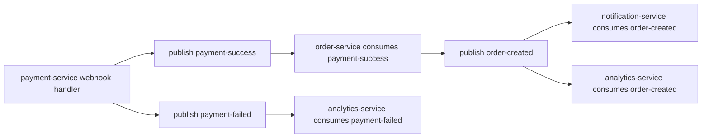

# Kafka

## Topics found in the repository

| Topic | Producer | Consumer |
| --- | --- | --- |
| `order-created` | `order-service` | `notification-service`, `analytics-service` |
| `payment-success` | `payment-service` | `order-service` |
| `payment-failed` | `payment-service` | `analytics-service` |

## Event schemas

### `order-created`

- `orderId`
- `userId`
- `email`
- `totalAmount`
- `items[]`
- `firstName`
- `phoneNumber`
- `status`

### `payment-success`

- `paymentId`
- `checkoutId`
- `userId`
- `transactionId`
- `amount`
- `items[]`
- `email`
- `firstName`
- `phoneNumber`

### `payment-failed`

- `paymentId`
- `checkoutId`
- `userId`
- `transactionId`
- `amount`

## Checkout/event flow

## Retry / delivery notes

- Producers use Spring Kafka `KafkaTemplate`
- `payment-service` waits on `.get()` for publish success/failure
- `order-service` publishes after transaction commit using `TransactionSynchronizationManager`
- `analytics-service` adds an application-level deduplication table via `processed_events`
