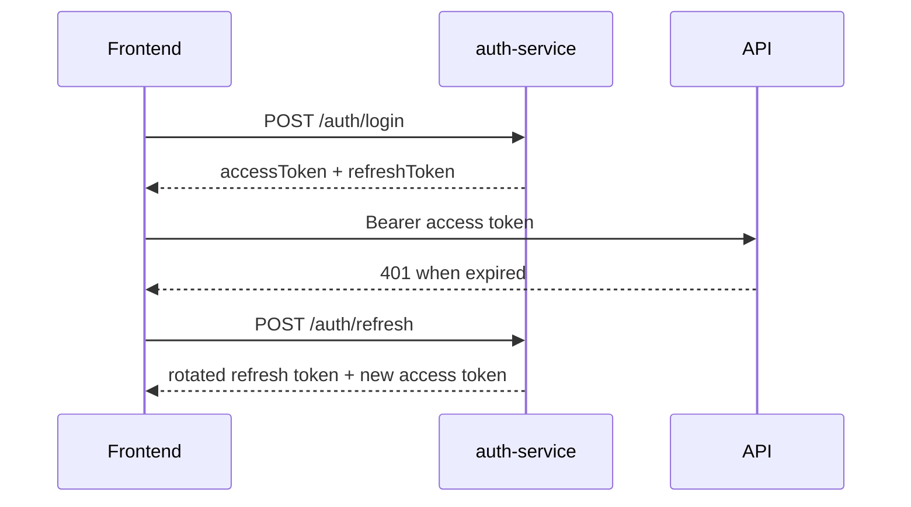

# Security

## Authentication model

- Access tokens are JWT bearer tokens
- Refresh tokens are persisted in `auth-service`
- Frontend stores tokens through `tokenStorage`
- Frontend retries once on `401` by calling `/auth/refresh`

## Authorization model

### Frontend

- `ProtectedRoute` blocks anonymous users
- `RoleGuard` restricts role-specific route trees
- `homePathForRole()` sends admins to `/admin/dashboard` and customers to `/dashboard`

### Backend

Every service validates JWTs independently with its own `JwtAuthenticationFilter`.

Examples:

- `analytics-service`: `/analytics/**` requires `ADMIN`
- `book-service`: mutations require `hasRole('ADMIN')`
- `user-service`: update is admin-or-self; delete is admin and not self
- `order-service`: all routes require authentication; service layer also checks self-vs-admin

## Password handling

`auth-service` uses `BCryptPasswordEncoder`.

## Token flow

## Public endpoints by service

- `auth-service`: login, register, refresh, logout
- `user-service`: `/api/user/create`
- `payment-service`: `/api/payments/webhook`, `/actuator/health`
- `book-service`: `/actuator/health`, `/actuator/info`
- `analytics-service`: `/actuator/health`, `/actuator/info`
