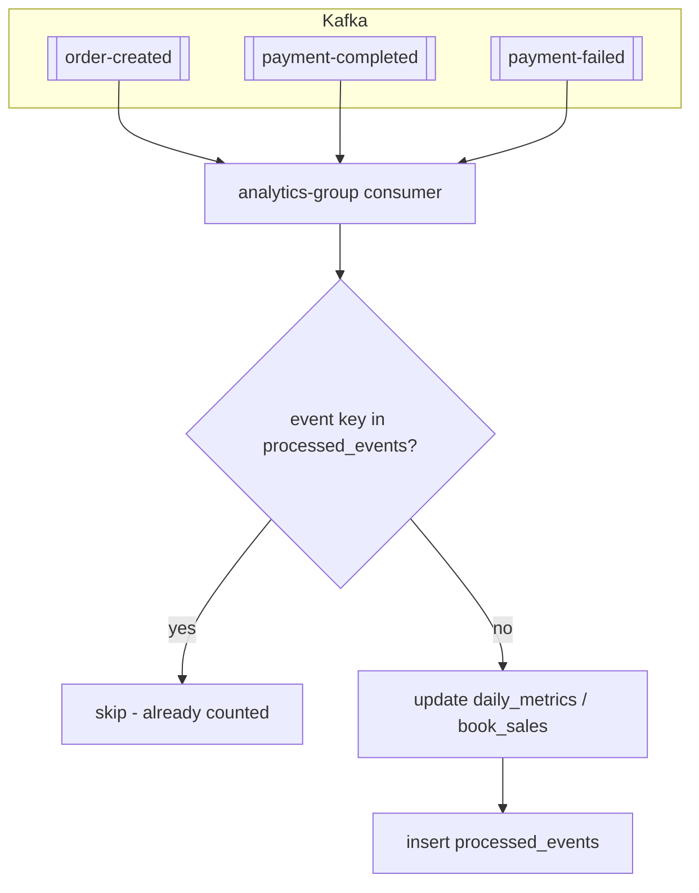
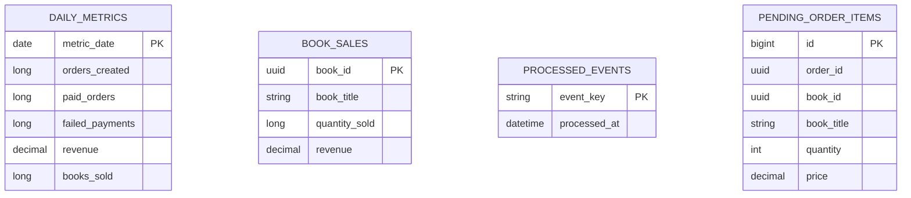

# Analytics Service

## Purpose

`analytics-service` exposes admin analytics APIs and maintains aggregate tables fed by Kafka events.

## Responsibilities

- Provide dashboard metrics
- Provide revenue, order, book, and payment analytics
- Consume order and payment events
- Deduplicate events using `processed_events`

## Dependencies

- Port: `8088`
- Database: `bookstore_analytics_db`
- Kafka consumer
- Admin-only JWT-protected APIs

## REST APIs

| Method | Path | Auth | Description |
| --- | --- | --- | --- |
| `GET` | `/analytics/dashboard` | Admin | High-level dashboard summary |
| `GET` | `/analytics/revenue` | Admin | Revenue totals, optional `from` and `to` |
| `GET` | `/analytics/revenue/daily` | Admin | Daily revenue series |
| `GET` | `/analytics/revenue/monthly` | Admin | Monthly revenue series |
| `GET` | `/analytics/orders` | Admin | Order analytics |
| `GET` | `/analytics/books` | Admin | Book sales analytics |
| `GET` | `/analytics/payments` | Admin | Payment analytics |

## Kafka

### Consumers

- `order-created`
- `payment-completed`
- `payment-failed`

### Aggregate tables

- `daily_metrics`
- `book_sales`
- `pending_order_items`
- `processed_events`

### Ingestion & deduplication

## Aggregate schema

## Deduplication

The service stores event keys like:

- `order-created:{orderId}`
- `payment-completed:{orderId}`
- `payment-failed:{paymentId}`

This prevents double-counting under at-least-once delivery.
