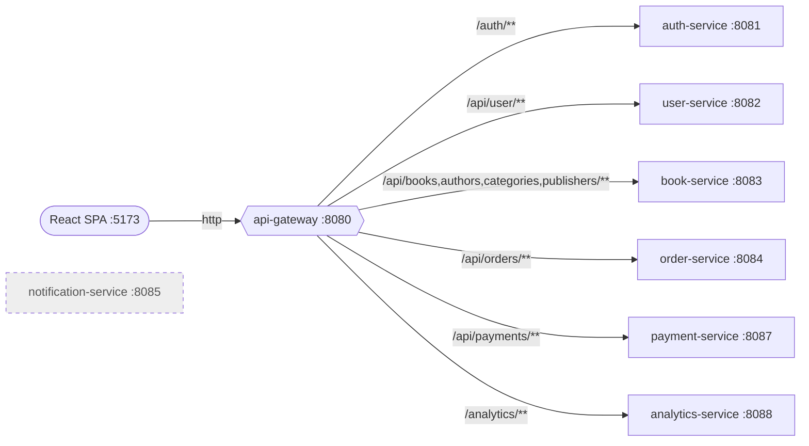

# API Gateway

## Purpose

`api-gateway` is the single HTTP entry point for the SPA and forwards requests to backend services using Spring Cloud Gateway Server WebFlux.

## Responsibilities

- Route public and authenticated HTTP traffic
- Apply CORS for local frontend origins
- Keep service base URLs configurable through environment variables

## Runtime

- Port: `8080`
- Stack: Spring Boot + Spring Cloud Gateway + Actuator

## Routes

| Route prefix | Target service |
| --- | --- |
| `/auth/**` | auth-service |
| `/api/user/**` | user-service |
| `/api/books/**` | book-service |
| `/api/authors/**` | book-service |
| `/api/categories/**` | book-service |
| `/api/publishers/**` | book-service |
| `/api/orders/**` | order-service |
| `/api/payments/**` | payment-service |
| `/analytics/**` | analytics-service |

## Routing map

`notification-service` is not reachable through the gateway — it only consumes Kafka events.

## CORS

Allowed origins in `application.yml`:

- `http://localhost:5173`
- `http://localhost:3000`

Allowed methods:

- `GET`
- `POST`
- `PUT`
- `DELETE`
- `OPTIONS`

## Dependencies

- Spring Cloud Gateway Server WebFlux
- Spring Boot Actuator

## Not routed by the gateway

The following paths are **not** proxied today:

- `/api/bookimage/**` — `BookImageController` exists but has no implemented endpoints
- notification-service — Kafka-only worker with no HTTP API

## Notes

The gateway is purely routing infrastructure. Authentication decisions are still enforced inside each downstream service.
