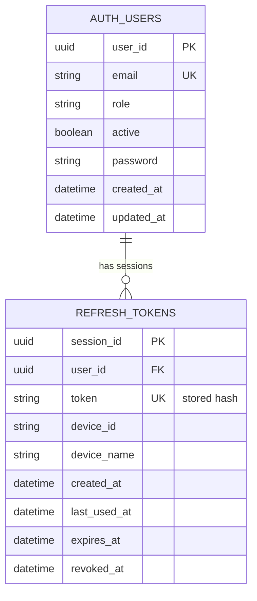
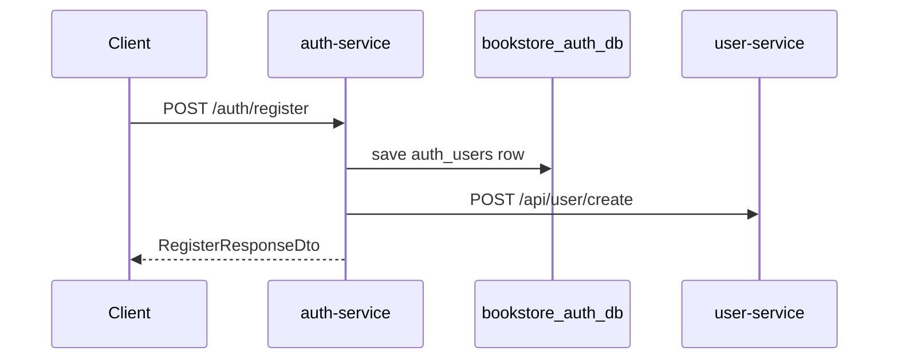
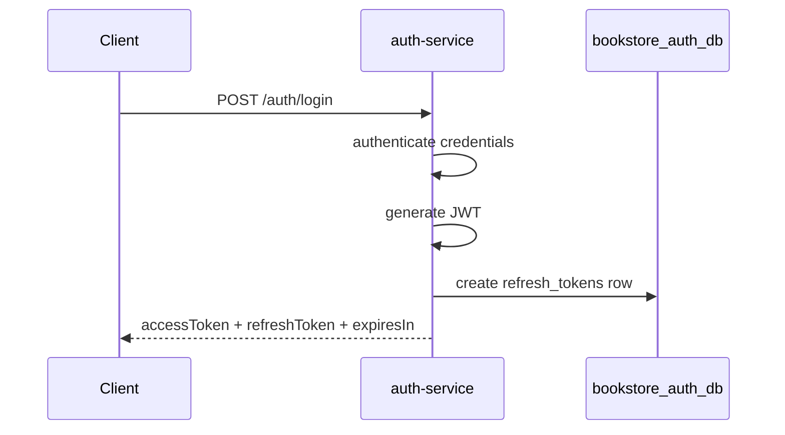
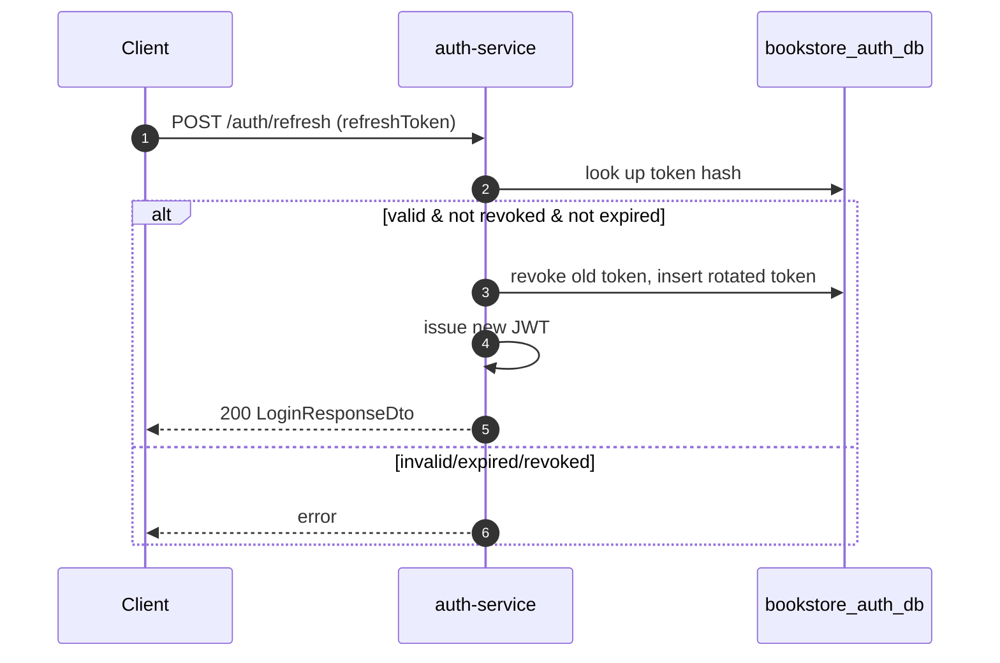

# Auth Service

## Purpose

`auth-service` owns authentication data, password hashing, JWT issuance, refresh-token-backed sessions, and logout flows.

## Responsibilities

- Register users
- Authenticate credentials
- Issue JWT access tokens
- Create and rotate refresh-token sessions
- Revoke a single session or all sessions
- Call `user-service` to create the profile record after registration

## Dependencies

- Port: `8081`
- Database: `bookstore_auth_db`
- Downstream HTTP: `user-service`
- Security: Spring Security + JWT

## REST APIs

| Method | Path | Auth | Description |
| --- | --- | --- | --- |
| `POST` | `/auth/register` | No | Create auth user and user profile |
| `POST` | `/auth/login` | No | Authenticate and issue tokens |
| `POST` | `/auth/logout` | No body auth, refresh token required | Revoke one refresh token |
| `POST` | `/auth/logout-all` | Yes | Revoke all sessions for current user |
| `POST` | `/auth/refresh` | No | Rotate refresh token and issue a new access token |

## Key DTOs

- `RegisterRequestDto`: email, password, firstName, lastName, phoneNumber, dateOfBirth, address
- `RegisterResponseDto`: userId, email, message
- `LoginRequestDto`: email, password, deviceId
- `LoginResponseDto`: accessToken, refreshToken, expiresIn
- `RefreshTokenRequestDto`: refreshToken

## Database tables

### `auth_users`

- `user_id`
- `email`
- `role`
- `active`
- `password`
- `created_at`
- `updated_at`

### `refresh_tokens`

- `session_id`
- `user_id`
- `token` (stored hash)
- `device_id`
- `device_name`
- `created_at`
- `last_used_at`
- `expires_at`
- `revoked_at`

Indexes exist on:

- `user_id`
- `device_id`
- `token` (unique)

## Entity relationships

## Security

Public routes in `SecurityConfig`:

- `/auth/login`
- `/auth/register`
- `/auth/refresh`
- `/auth/logout`

Authenticated route:

- `/auth/logout-all`

Passwords are encoded with `BCryptPasswordEncoder`.

## Internal flow

## Error handling

- Duplicate email -> `DuplicateResourceException`
- Unknown user during login/refresh -> `ResourceNotFoundException`
- Invalid or revoked refresh token -> refresh flow fails

## Sequence diagram: login

## Sequence diagram: refresh rotation

