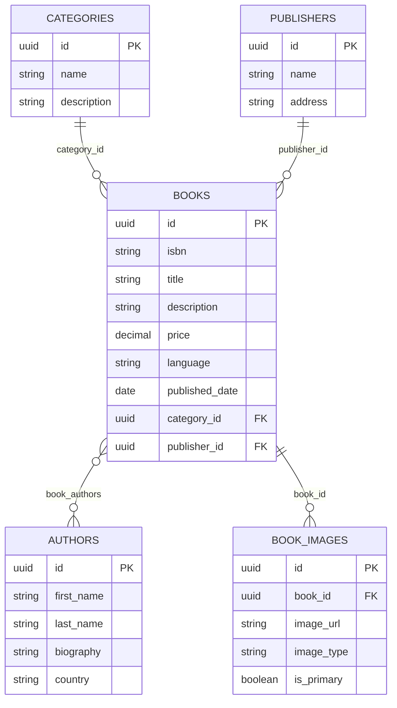
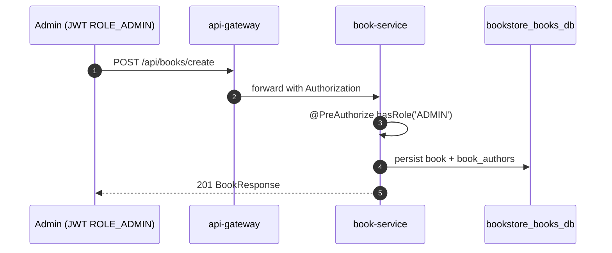
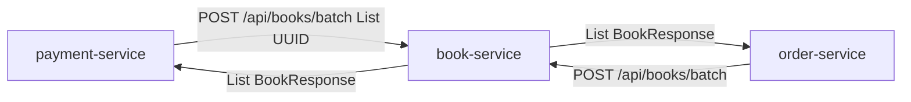

# Book Service

## Purpose

`book-service` is the catalog system for books and supporting reference data.

## Responsibilities

- CRUD for books
- CRUD for authors
- CRUD for categories
- CRUD for publishers
- Batch fetch books by IDs for checkout/order flows

## Dependencies

- Port: `8083`
- Database: `bookstore_books_db`

## REST APIs

### Books

| Method | Path | Auth | Description |
| --- | --- | --- | --- |
| `POST` | `/api/books/create` | Admin | Create book |
| `PUT` | `/api/books/update/{id}` | Admin | Update book |
| `DELETE` | `/api/books/{id}` | Admin | Delete book |
| `GET` | `/api/books/{id}` | Yes | Get one book |
| `POST` | `/api/books/batch` | Yes | Fetch many books by UUID list |
| `GET` | `/api/books/` | Yes | List all books |

### Authors

- `POST /api/authors/create` (Admin)
- `PUT /api/authors/update/{id}` (Admin)
- `GET /api/authors/{id}`
- `DELETE /api/authors/{id}` (Admin)
- `GET /api/authors/`

### Categories

- `POST /api/categories/create` (Admin)
- `PUT /api/categories/update/{id}` (Admin)
- `GET /api/categories/{id}`
- `DELETE /api/categories/{id}` (Admin)
- `GET /api/categories/`

### Publishers

- `POST /api/publishers/create` (Admin)
- `PUT /api/publishers/update/{id}` (Admin)
- `GET /api/publishers/{id}`
- `DELETE /api/publishers/{id}` (Admin)
- `GET /api/publishers/`

### Book images

`BookImageController` exists with base path `/api/bookimage`, but there are no implemented endpoints in the current code.

## Database tables

- `books`
- `authors`
- `categories`
- `publishers`
- `book_images`
- join table `book_authors`

## Entity relationships

## Admin write flow

## Batch fetch (used by order & payment)

## Security

Only `/actuator/health` and `/actuator/info` are public in the service security config. All catalog routes require authentication, and mutations additionally require admin privileges at the controller layer.
