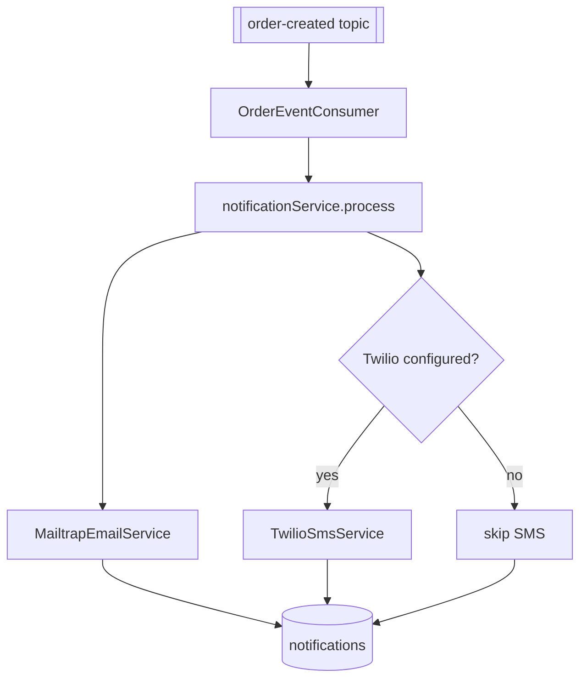
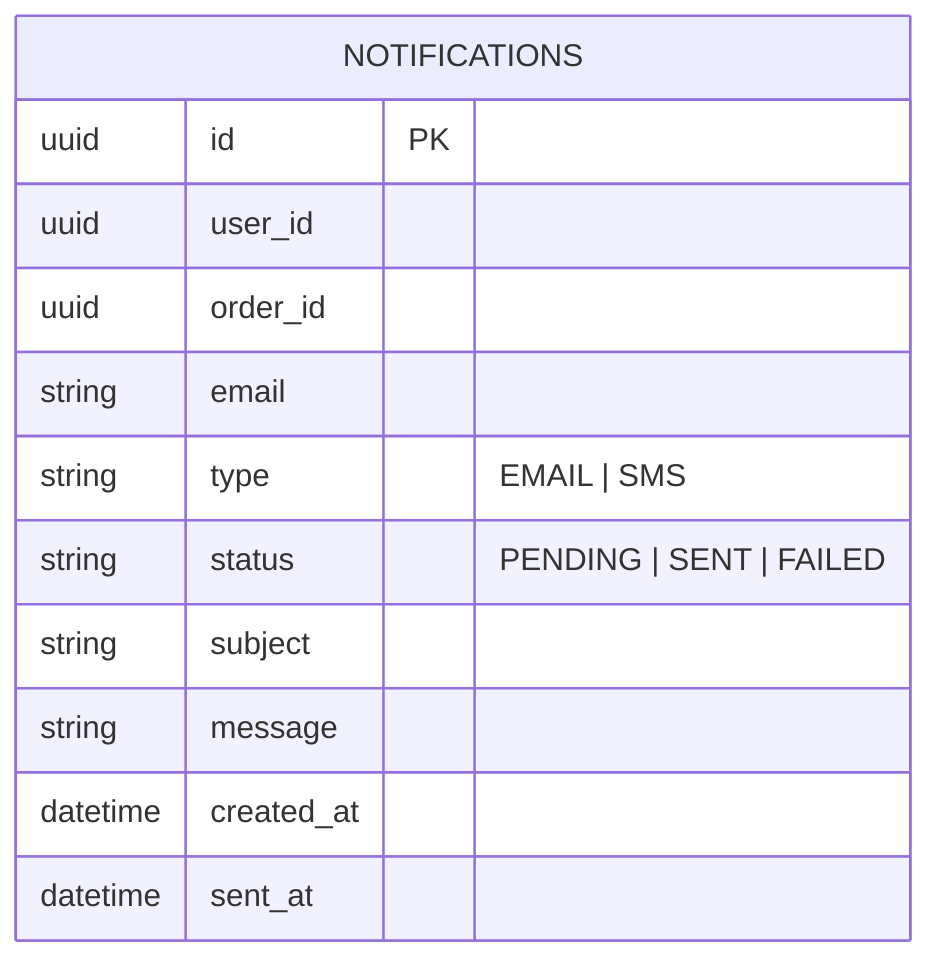

# Notification Service

## Purpose

`notification-service` reacts to order events and sends notifications by email and SMS while persisting notification records.

## Responsibilities

- Consume `order-created`
- Send email using Spring Mail / Mailtrap
- Send SMS using Twilio
- Persist notification history

## Dependencies

- Port: `8085`
- Database: `bookstore_notification_db`
- Kafka consumer
- Mail transport
- Twilio SDK

## Kafka

### Consumer

- Topic: `order-created`
- Group: `notification-group`

`OrderEventConsumer` logs the inbound event and calls `notificationService.process(event)`.

### Delivery flow

## Database table

### `notifications`

- `id`
- `user_id`
- `order_id`
- `email`
- `type`
- `status`
- `subject`
- `message`
- `created_at`
- `sent_at`

## Delivery integrations

### Email

Implemented by `MailtrapEmailService` through `JavaMailSender`.

### SMS

Implemented by `TwilioSmsService` through Twilio `Message.creator(...)`.

`TwilioConfig` initializes Twilio only when account SID and auth token are present.

## Configuration

Environment-backed values currently used:

- `MAIL_HOST`
- `MAIL_PORT`
- `MAIL_USERNAME`
- `MAIL_PASSWORD`
- `TWILIO_ACCOUNT_SID`
- `TWILIO_AUTH_TOKEN`
- `TWILIO_PHONE_NUMBER`

## REST APIs

No business REST controllers are present in the current repository for this service.

## Security

`notification-service` does not include Spring Security in its current `pom.xml`. It is intended to run as an internal Kafka consumer rather than a public HTTP API.
