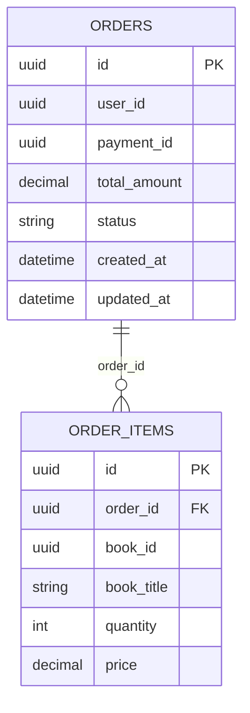
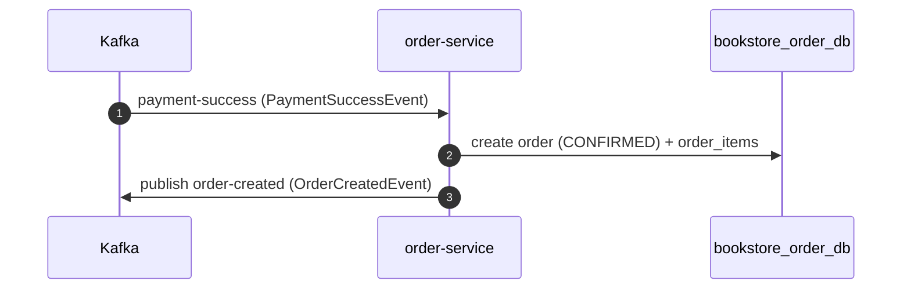

# Order Service

## Purpose

`order-service` stores orders and builds confirmed orders from successful payment events.

## Responsibilities

- Return order history and order details
- Allow customer cancellation in allowed statuses
- Allow admin status updates
- Consume `payment-success`
- Publish `order-created`

## Dependencies

- Port: `8084`
- Database: `bookstore_order_db`
- HTTP dependencies: `book-service`, `user-service`
- Kafka dependency: consumes and produces

## REST APIs

| Method | Path | Auth | Description |
| --- | --- | --- | --- |
| `PUT` | `/api/orders/{orderId}/status?status=` | Admin | Update order status |
| `POST` | `/api/orders/{orderId}/cancel` | Yes | Cancel own order |
| `GET` | `/api/orders` | Admin | List all orders |
| `GET` | `/api/orders/me` | Yes | List current user's orders |
| `GET` | `/api/orders/userId?id=` | Yes | Get orders by user ID |
| `GET` | `/api/orders/payment/{paymentId}` | Yes | Get order by payment ID |
| `GET` | `/api/orders/{id}` | Yes | Get order by order ID |

## Kafka

### Consumer

- Topic: `payment-success`
- Group: `order-group`

### Producer

- Topic: `order-created`

### Outbound event

`OrderCreatedEvent` fields:

- `orderId`
- `userId`
- `email`
- `totalAmount`
- `items[]`
- `firstName`
- `phoneNumber`
- `status`

## Database tables

### `orders`

- `id`
- `user_id`
- `payment_id`
- `total_amount`
- `status`
- `created_at`
- `updated_at`

### `order_items`

- `id`
- `book_id`
- `book_title`
- `quantity`
- `price`
- `order_id`

## Entity relationships

## Internal flow

## Status transitions

See the [Orders API](../api/orders.md#status-lifecycle-typical-happy-path) page for the full status state diagram.
