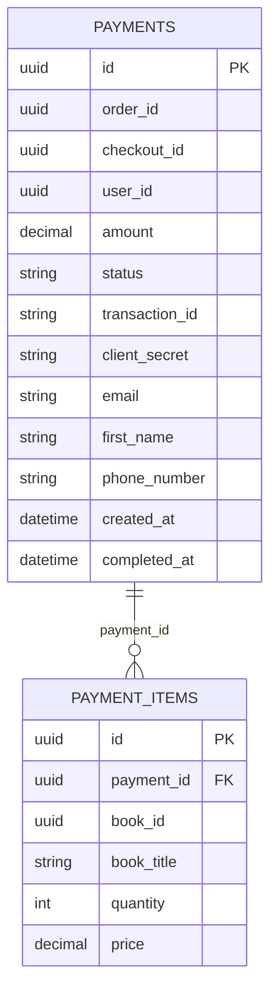
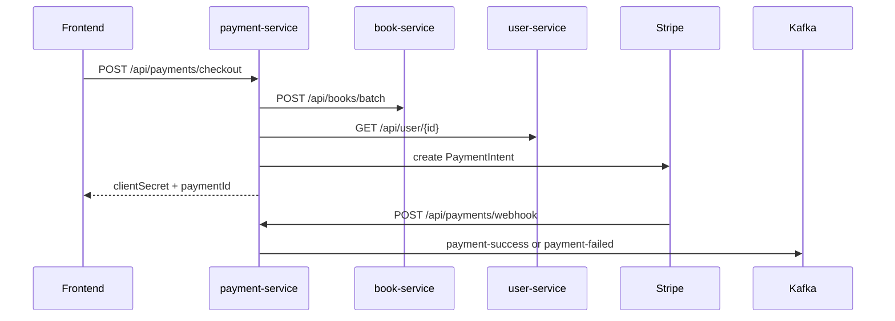

# Payment Service

## Purpose

`payment-service` creates Stripe PaymentIntents, stores checkout/payment state, handles Stripe webhooks, and publishes payment outcome events.

## Responsibilities

- Create checkout records from cart items
- Fetch payment state by payment ID
- Re-publish payment success for recovery
- Receive Stripe webhooks
- Publish success/failure Kafka events

## Dependencies

- Port: `8087`
- Database: `bookstore_payment_db`
- HTTP dependencies: `book-service`, `user-service`
- External dependency: Stripe
- Kafka dependency: producer

## REST APIs

| Method | Path | Auth | Description |
| --- | --- | --- | --- |
| `POST` | `/api/payments/checkout` | Yes | Create or reuse checkout |
| `GET` | `/api/payments/{paymentId}` | Yes | Get payment for current user |
| `POST` | `/api/payments/{paymentId}/sync-order` | Yes | Re-publish `payment-success` for an already successful payment |
| `POST` | `/api/payments/webhook` | No | Stripe webhook endpoint |

## Request and response types

### `POST /api/payments/checkout`

Headers:

- `Authorization: Bearer <access token>`

Body:

```json
{
  "checkoutId": "uuid",
  "items": [
    {
      "bookId": "uuid",
      "quantity": 2
    }
  ]
}
```

Validation:

- `checkoutId` required
- `items` required and non-empty
- `quantity` must be between `1` and `2000`

Response:

- `paymentId`
- `checkoutId`
- `orderId`
- `amount`
- `status`
- `paymentIntentId`
- `clientSecret`
- `items[]`

## Kafka

### Success topic

- Topic: `payment-success`
- Event: `PaymentSuccessEvent`

Fields:

- `paymentId`
- `checkoutId`
- `userId`
- `transactionId`
- `amount`
- `items[]`
- `email`
- `firstName`
- `phoneNumber`

### Failure topic

- Topic: `payment-failed`
- Event: `PaymentFailedEvent`

Fields:

- `paymentId`
- `checkoutId`
- `userId`
- `transactionId`
- `amount`

## Database tables

- `payments`
- `payment_items`

## Entity relationships



## Payment flow



## Error handling

- Checkout for another user's existing `checkoutId` -> access denied
- Missing book or price -> `ResourceNotFoundException`
- Non-positive totals -> `IllegalArgumentException`
- Invalid webhook signature -> runtime error
- Fetching a payment not owned by the current user -> not found
