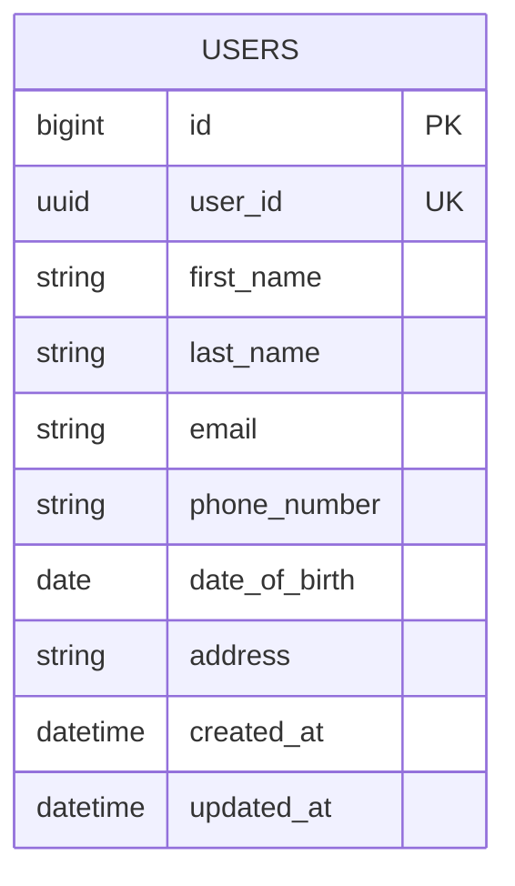
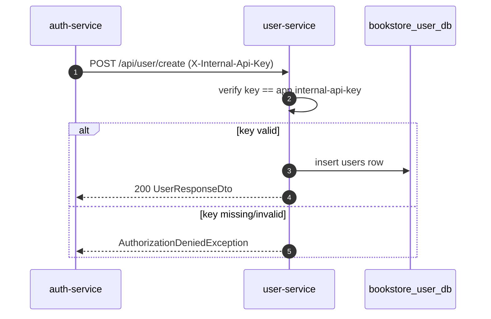

# User Service

## Purpose

`user-service` stores profile data separate from authentication data.

## Responsibilities

- Create user profile records during registration
- Return profile data
- Update profile data
- List and delete profiles for admins

## Dependencies

- Port: `8082`
- Database: `bookstore_user_db`
- Inbound internal API key from `auth-service`

## REST APIs

| Method | Path | Auth | Description |
| --- | --- | --- | --- |
| `GET` | `/api/user/{id}` | Yes | Get a user profile by ID |
| `POST` | `/api/user/create` | Internal API key | Create profile during registration |
| `GET` | `/api/user/` | Admin | List all profiles |
| `PUT` | `/api/user/update/{id}` | Admin or self | Update profile |
| `DELETE` | `/api/user/{id}` | Admin, not self | Delete profile |
| `GET` | `/api/user/search?keyword=` | Admin | Search by first name |

## Security

Public request matchers:

- `/api/user/create`

Controller rules:

- `getAll`, `search`, `delete`: `hasRole('ADMIN')`
- `update`: admin or same user
- self-delete is blocked with `#id.toString() != authentication.name`

## Database table

### `users`

- `id`
- `user_id`
- `first_name`
- `last_name`
- `email`
- `phone_number`
- `date_of_birth`
- `address`
- `created_at`
- `updated_at`

## Entity relationship

## Profile creation during registration

## Notes

`auth-service` and `user-service` each have their own user table. That is intentional in the current design:

- `auth-service` owns credentials and roles
- `user-service` owns profile fields
